# 大学选课系统 数据库设计文档

本文档描述选课系统的数据库结构、约束、事务边界与典型读写流程。

- 数据库：SQLite（`better-sqlite3`，单机单后端进程、单例连接）
- 后端：Express + TypeScript，模块化单体
- 结构事实来源（本文档所有字段名、函数名、枚举取值均取自这些文件，未做任何推测性扩展）：
  - `server/src/db/migrations/001_init.sql`（33 张表）
  - `server/src/db/migrations/002_term_required.sql`（1 张表）
  - `server/src/db/migrations/003_preference_drafts.sql`（1 张表）
  - `server/src/db/migrations/004_material_scope_and_prealloc.sql`（重建 2 张表：扩展资料版本 scope、修正预分配批次关联）
  - `server/src/db/migrations/005_confirmations_nullable.sql`（重建 1 张表：允许在尚无正式资料版本时确认修读记录）
  - `server/src/db/index.ts`（迁移机制、`user_version`、WAL、外键、事务）
  - `server/src/db/seed.ts`（演示数据规模与生成规则）
  - `server/src/db/cli.ts`（`db:init` / `db:seed` / `db:reset` / `db:status`）
  - `server/src/modules/rules/service.ts`、`enrollment/service.ts`、`allocation/service.ts`、`preference/service.ts`、`waitlist/service.ts`、`materials/service.ts`、`preallocation/service.ts`、`curriculum/service.ts`
  - 辅助：`server/src/modules/batch/service.ts`、`server/src/modules/catalog/service.ts`、`server/src/modules/catalog/seat-utils.ts`、`server/src/core/utils.ts`、`server/src/core/audit.ts`、`server/src/core/password.ts`、`server/src/config.ts`

> 约定：文中「有效选课记录」等价于 `enrollments.status = 'enrolled'` 的行。名额（座位）只由这一张表的行数决定。

---

## 1. 设计目标与原则

### 1.1 为什么手写 SQL + `user_version` 迁移，而不是 ORM

代码依据：`server/src/db/index.ts`

- `openDatabase()` 打开数据库后立即设置 `journal_mode = WAL`、`foreign_keys = ON`、`busy_timeout = 5000`，保证「外键真的生效」「读写不互相阻塞」。
- `migrate()` 通过 `listMigrationFiles()` 读取 `migrations/` 下所有 `.sql` 文件并按**文件名排序**；文件名前三位必须是整数版本号（否则抛 `迁移文件名必须以三位版本号开头`）；只执行 `文件版本号 > user_version` 的文件。
- 每个迁移包在一个 `db.transaction(() => { db.exec(sql); db.pragma('user_version = N'); })` 中：结构变更与版本号**同事务提交**，失败整体回滚，不会留下「建了一半表但版本号已经加过」的坏状态。
- 正式运行时整个进程共用一个连接（`getDatabase()` 单例），`better-sqlite3` 是同步 API，写操作天然串行。

之所以不用 ORM，是因为这个系统的正确性几乎全部押在**精确落库的约束**上：

1. 部分唯一索引（`WHERE status = 'enrolled'`、`WHERE status = 'submitted'`）在多数 ORM 中表达能力不足或语义不直观；
2. 表级 `CHECK`（如 `reserved_seats <= capacity`）、复合主键（`student_course_random_keys`）需要直接写在建表语句里才可审查；
3. 手写 SQL 让「每条约束防住哪个错误」可以与代码一一对照，评审时看 SQL 即可，不必再穿透 ORM 抽象。

### 1.2 为什么把「名额」收敛成唯一写入入口

- 数据库层：`enrollments` 是名额占用的**唯一来源**。`server/src/modules/catalog/service.ts` 的 `getSeatUsage()` 用 `COUNT(*)` 从 `enrollments` 实时算出：
  - `generalAvailable = max(0, capacity - reserved_seats - (enrolled - usedReserved))`
  - `totalAvailable = max(0, capacity - enrolled)`
- 服务层：`server/src/modules/enrollment/service.ts` 的 `EnrollmentService` 是唯一可以改名额的模块。所有需要占名额的业务都调用它：
  - 预分配：`preallocation/service.ts` → `applyPreallocations()` → `service.allocateTo()`
  - 统一分配发布：`allocation/service.ts` → `publishDecisions()` → `service.allocateTo()`
  - 候补提升：`waitlist/service.ts` → `tryPromote()` → `service.allocateTo()`
  - 授权升级：`enrollment/service.ts` → `upgrade()`（内部走同一个 `mutate()`）
  - 学生手工选退换课：路由 `/enroll`、`/drop`、`/swap` → `enroll()` / `drop()` / `swap()` / `replace()`

  这样「时间冲突怎么算、学分上限怎么算、重复课程怎么判、名额怎么复核」只有一套实现，不会出现「分配说能选、真正选课又失败」的两套规则。

### 1.3 为什么需要版本与快照

| 机制 | 表 / 字段 | 解决的问题 |
| --- | --- | --- |
| 资料版本 | `data_versions`（`scope` + `version_no` + `content_hash` + `active`） | 每次发布资料产生一个不可变版本号；内容哈希可用于判断内容是否真的变化；同一 `scope` 只保留一条 `active = 1` |
| 学生确认 | `source_confirmations`（`invalidated_at`） | 记录学生确认的是**哪一版**资料；资料变化后置 `invalidated_at`，需要重新确认 |
| 志愿提交版本 | `preference_submissions.version_no` | 截止时以最后一次成功提交的完整版本为准；历史版本保留可审计 |
| 冻结快照 | `batch_snapshots.payload` + `content_hash` + `rng_seed` | 冻结之后，志愿、资料、新增选课的变化都不影响本轮结果 |
| 固定随机键 | `student_course_random_keys(random_key)` | 由 `sha256(seed:studentId:courseId)` 派生（`core/utils.ts` 的 `deriveRandomKey`），**不依赖运行时随机数**；重交、重试、退出后重新加入都不重抽 |
| 请求幂等 | `enrollment_operations.idempotency_key` + `request_hash` | 同一次用户意图重复提交不重复执行；换了请求内容却复用同一个键会被识别为冲突 |

---

## 2. 核心实体与关系说明（面向没有系统设计基础的读者）

### 2.1 账号与学生

- **users**：所有能登录的人，一条记录一个账号，`role` 只有 `student` / `admin` 两种，`status` 为 `active` / `disabled`。
- **students**：学生档案，主键就是 `users.id`（一人一档，账号删了档案跟着删）。`student_no`（学号）唯一。`program_id` 指向培养方案。
- **sessions**：服务器会话。登录成功后写入一行，登出或过期即失效，因此会话可以随时被撤销（不依赖 JWT）。

### 2.2 课程、教学班与时段

- **courses**：课程目录，`code` 唯一，`credits`（学分）必须为正，`course_type` 区分必修 / 限选 / 任选 / 通识。
- **teachers**：教师名册。
- **teaching_classes**：教学班，是**名额的载体**。有 `capacity`（总容量）、`reserved_seats`（毕业保障预留名额）、`status`（`open` / `closed` / `cancelled`）。`class_code` 唯一。
- **class_sessions**：上课时段。一个教学班可以有**多个时段**，每个时段带星期、起止节次、起止教学周和单双周（`week_parity` = `all` / `odd` / `even`）。

一句话理解：**课程**是「教什么」，**教学班**是「谁在什么时候教、有多少座位」，**时段**是「占哪几节课」。

### 2.3 培养方案、需求与课程抵扣

- **programs**：培养方案（版本、总学分、状态 `draft` / `published` / `archived`）。
- **curriculum_requirements**：方案下的需求类别（例如「专业核心课程」），带 `required_credits`（要求学分）、`min_courses`（最少门数）、`priority`（数字越小越关键）。
- **curriculum_courses**：需求类别与课程的对应关系，`relation` 为 `direct`（直接对应）或 `substitute`（可替代）。同一门课在计算培养进度时**只在一个类别里计分**（`rules/service.ts` 的 `computeProgress()` 按 `direct` 优先、再按需求 `priority` 取第一个匹配项）。

### 2.4 修读记录与资料确认

- **student_course_records**：学生已通过 / 未通过 / 在修 / 已选记录。已选不等于已通过，所以状态分得很细。同一「学生 + 课程 + 状态 + 学期」只保留一条。
- **import_batches**：一次导入的批次（课程 / 教学班 / 培养方案 / 修读记录 / 预分配），保存解析后的 `payload` 与校验 `report`。
- **data_versions**：资料发布版本，带内容哈希。
- **source_confirmations**：学生对某一版资料的确认记录。
- **app_configs**：系统配置（学分上限、任务超时、公开补选开关、同课换班开关、在线模型开关等）。

### 2.5 预分配

- **preallocation_results**：专业课预分配结果，`status` 为 `pending` / `applied` / `failed` / `reverted`。`margin` 是管理员希望留出的**调整余量**——预分配不能把教学班塞满。

### 2.6 选课批次、冻结快照、分配任务与分配明细

- **selection_batches**：选课批次，状态机为 `preparing` → `preview` / `open` → `frozen` → `published` → `waitlist` → `closed`。批次带自己的 `credit_limit` 与开放 / 截止时间。
- **batch_snapshots**：冻结快照，一个批次最多一条（`UNIQUE(batch_id)`）。里面冻结了当时的教学班与时段、每名学生的志愿、需求等级、随机键、已落实课程、毕业保障名单和名额使用情况。
- **allocation_runs**：一次分配执行（试算 `simulate` 或发布 `publish`）。同一批次多次执行就是多个 `attempt`（`UNIQUE(batch_id, attempt)`）。
- **allocation_items**：分配明细，逐条记录「某学生某课程为什么被落实 / 落选 / 出错」，包含 `demand_level`、`global_rank`、`random_key`、`score_trace`，用于解释与审计。

### 2.7 志愿：草稿、提交版本、替代组、教学班偏好、固定随机键

- **preference_drafts**：自动保存的草稿，一名学生一个批次一条（主键 `student_id + batch_id`）。草稿不参与分配。
- **preference_submissions**：一次正式提交产生的**不可变版本**。
- **preferences**：该版本里的课程志愿，含全局排名 `global_rank`（同一版本内唯一且为正整数）。
- **preference_groups**：替代组（互斥组），组内最多落实一门。
- **preference_group_courses**：替代组包含哪些课程。
- **preference_class_choices**：同一门课程内对多个教学班的偏好顺序。
- **student_course_random_keys**：学生在一个学期内针对一门课程的固定随机键。

### 2.8 实际选课记录

- **enrollments**：真正落实的选课记录，也是名额占用的唯一来源。`status` 为 `enrolled` / `dropped` / `cancelled`；`source` 说明名额从哪来（预分配 / 统一分配 / 毕业保障 / 候补提升 / 升级 / 手工）；`uses_reserved = 1` 表示这条记录占用的是毕业保障预留名额。

### 2.9 毕业保障预留、替换授权

- **graduation_reservations**：毕业保障名单，管理员**按课程**确认。状态 `active` / `fulfilled` / `abnormal` / `released` / `revoked`。
- **upgrade_authorizations**：替换（升级）授权，必须写清「用哪门目标课程替换哪门原课程」以及可选的目标教学班；授权带 `version_id`，关键资料变化后会被标记 `invalidated`。

### 2.10 候补队列

- **waitlist_entries**：候补队列。一人一课程一条（`UNIQUE(student_id, batch_id, course_id)`）。状态 `queued` / `suspended` / `promoted` / `closed` / `withdrawn`。`position_hint` 只是**展示用的顺位提示，不构成承诺**（真实顺位每次由 `computeQueue()` 按当前需求、排名、固定随机键重算）。

### 2.11 操作记录、审计与异常清单

- **enrollment_operations**：名额相关操作的请求记录，带 `idempotency_key` 与 `request_hash`，是幂等的依据。
- **audit_logs**：关键操作的审计流水（资料版本、分配依据、授权、课表变更等由 `core/audit.ts` 的 `writeAudit()` 统一写入）。
- **exceptions**：待处理异常清单，例如「保障无解」「资料变化待重新确认」「分配超时」。发布批次前必须对关键异常形成处理结果。

### 2.12 学期必需课程（002 迁移）

- **term_required_courses**：管理员确认的「本学期必须完成」名单，是 D2 需求等级的正式依据之一。

---

## 3. Mermaid ER 图

```mermaid
erDiagram
    users {
        INTEGER id PK
        TEXT username UK
        TEXT password_hash
        TEXT display_name
        TEXT role
        TEXT status
        TEXT created_at
        TEXT last_login_at
    }
    students {
        INTEGER user_id PK
        TEXT student_no UK
        TEXT name
        TEXT grade
        TEXT major
        INTEGER program_id
        INTEGER admitted_year
        TEXT expected_graduate_at
        TEXT created_at
    }
    sessions {
        TEXT token PK
        INTEGER user_id FK
        TEXT created_at
        TEXT expires_at
        TEXT user_agent
    }
    courses {
        INTEGER id PK
        TEXT code UK
        TEXT name
        REAL credits
        TEXT department
        TEXT course_type
        TEXT description
        TEXT created_at
    }
    teachers {
        INTEGER id PK
        TEXT name
        TEXT department
        TEXT title
    }
    teaching_classes {
        INTEGER id PK
        INTEGER course_id FK
        TEXT class_code UK
        TEXT term
        INTEGER teacher_id FK
        INTEGER capacity
        INTEGER reserved_seats
        TEXT status
        TEXT campus
        TEXT note
        TEXT created_at
    }
    class_sessions {
        INTEGER id PK
        INTEGER class_id FK
        INTEGER day_of_week
        INTEGER period_start
        INTEGER period_end
        INTEGER week_start
        INTEGER week_end
        TEXT week_parity
        TEXT room
    }
    programs {
        INTEGER id PK
        TEXT code UK
        TEXT name
        TEXT grade
        TEXT major
        REAL total_credits
        TEXT version
        TEXT published_at
        TEXT status
        TEXT created_at
    }
    curriculum_requirements {
        INTEGER id PK
        INTEGER program_id FK
        TEXT code
        TEXT name
        TEXT category
        REAL required_credits
        INTEGER min_courses
        INTEGER priority
        TEXT note
    }
    curriculum_courses {
        INTEGER id PK
        INTEGER requirement_id FK
        INTEGER course_id FK
        TEXT relation
        INTEGER priority
    }
    student_course_records {
        INTEGER id PK
        INTEGER student_id FK
        INTEGER course_id FK
        TEXT status
        TEXT term
        REAL credits
        TEXT source
        INTEGER verified
        INTEGER version_id
        TEXT updated_at
    }
    import_batches {
        INTEGER id PK
        TEXT kind
        TEXT file_name
        TEXT file_hash
        TEXT status
        INTEGER row_count
        INTEGER error_count
        TEXT payload
        TEXT report
        INTEGER created_by FK
        TEXT created_at
        TEXT published_at
    }
    data_versions {
        INTEGER id PK
        TEXT scope
        INTEGER version_no
        TEXT content_hash
        TEXT summary
        INTEGER batch_id FK
        INTEGER published_by FK
        TEXT published_at
        INTEGER active
    }
    source_confirmations {
        INTEGER id PK
        INTEGER student_id FK
        INTEGER version_id FK
        TEXT confirmed_at
        TEXT invalidated_at
        TEXT note
    }
    app_configs {
        TEXT key PK
        TEXT value
        TEXT value_type
        TEXT description
        INTEGER updated_by FK
        TEXT updated_at
    }
    preallocation_results {
        INTEGER id PK
        INTEGER student_id FK
        INTEGER class_id FK
        INTEGER batch_id FK
        TEXT status
        TEXT failure_code
        TEXT reason
        INTEGER margin
        TEXT created_at
        TEXT applied_at
    }
    selection_batches {
        INTEGER id PK
        TEXT term
        TEXT name
        TEXT status
        REAL credit_limit
        TEXT open_at
        TEXT close_at
        TEXT published_at
        TEXT closed_at
        INTEGER config_version_id FK
        TEXT note
        INTEGER created_by FK
        TEXT created_at
    }
    batch_snapshots {
        INTEGER id PK
        INTEGER batch_id FK
        TEXT content_hash
        TEXT payload
        TEXT rng_seed
        INTEGER frozen_by FK
        TEXT frozen_at
    }
    allocation_runs {
        INTEGER id PK
        INTEGER batch_id FK
        INTEGER attempt
        TEXT mode
        TEXT status
        TEXT snapshot_hash
        TEXT idempotency_key
        TEXT started_at
        TEXT finished_at
        INTEGER duration_ms
        INTEGER timeout_ms
        TEXT failure_code
        TEXT failure_reason
        TEXT result_summary
        TEXT report
        INTEGER created_by FK
        TEXT created_at
    }
    allocation_items {
        INTEGER id PK
        INTEGER run_id FK
        INTEGER student_id FK
        INTEGER batch_id FK
        INTEGER course_id FK
        INTEGER preference_id
        INTEGER class_id FK
        INTEGER group_id
        TEXT demand_level
        INTEGER global_rank
        TEXT random_key
        INTEGER order_index
        TEXT decision
        TEXT reason_code
        TEXT reason
        TEXT score_trace
        TEXT created_at
    }
    preference_submissions {
        INTEGER id PK
        INTEGER student_id FK
        INTEGER batch_id FK
        INTEGER version_no
        TEXT status
        INTEGER program_version_id FK
        INTEGER records_version_id FK
        TEXT submitted_at
        TEXT withdrawn_at
        TEXT content_hash
        TEXT summary
    }
    preferences {
        INTEGER id PK
        INTEGER submission_id FK
        INTEGER course_id FK
        INTEGER global_rank
        TEXT note
    }
    preference_groups {
        INTEGER id PK
        INTEGER submission_id FK
        TEXT code
        TEXT name
        INTEGER rank_hint
        TEXT note
    }
    preference_group_courses {
        INTEGER group_id PK
        INTEGER course_id PK
        INTEGER priority
    }
    preference_class_choices {
        INTEGER id PK
        INTEGER preference_id FK
        INTEGER class_id FK
        INTEGER class_rank
    }
    student_course_random_keys {
        INTEGER student_id PK
        INTEGER course_id PK
        TEXT term PK
        TEXT random_key
        TEXT created_at
    }
    enrollments {
        INTEGER id PK
        INTEGER student_id FK
        INTEGER class_id FK
        INTEGER course_id FK
        TEXT status
        TEXT source
        INTEGER uses_reserved
        INTEGER batch_id FK
        INTEGER allocation_run_id FK
        REAL granted_credit
        TEXT reason
        TEXT created_at
        TEXT updated_at
        TEXT dropped_at
    }
    graduation_reservations {
        INTEGER id PK
        INTEGER batch_id FK
        INTEGER course_id FK
        INTEGER student_id FK
        TEXT status
        TEXT reason
        INTEGER confirmed_by FK
        TEXT confirmed_at
        TEXT released_at
    }
    upgrade_authorizations {
        INTEGER id PK
        INTEGER student_id FK
        INTEGER batch_id FK
        INTEGER source_course_id FK
        INTEGER source_class_id FK
        INTEGER target_course_id FK
        INTEGER target_class_id FK
        TEXT status
        INTEGER version_id FK
        INTEGER granted_by FK
        TEXT granted_at
        TEXT expires_at
        TEXT used_at
        TEXT invalidated_at
        TEXT note
    }
    waitlist_entries {
        INTEGER id PK
        INTEGER student_id FK
        INTEGER batch_id FK
        INTEGER course_id FK
        INTEGER preference_id
        TEXT class_choices
        TEXT status
        TEXT demand_level
        INTEGER global_rank
        TEXT random_key
        TEXT suspend_code
        TEXT suspend_reason
        TEXT close_code
        TEXT close_reason
        INTEGER position_hint
        TEXT created_at
        TEXT updated_at
        TEXT promoted_at
        TEXT withdrawn_at
    }
    enrollment_operations {
        INTEGER id PK
        INTEGER student_id FK
        INTEGER actor_id FK
        TEXT op_type
        TEXT idempotency_key
        TEXT request_hash
        INTEGER source_class_id FK
        INTEGER target_class_id FK
        INTEGER target_course_id FK
        INTEGER authorization_id FK
        TEXT status
        TEXT error_code
        TEXT message
        TEXT detail
        TEXT created_at
    }
    audit_logs {
        INTEGER id PK
        INTEGER actor_id FK
        TEXT actor_name
        TEXT action
        TEXT entity_type
        TEXT entity_id
        TEXT summary
        TEXT detail
        TEXT created_at
    }
    exceptions {
        INTEGER id PK
        INTEGER batch_id FK
        INTEGER run_id FK
        INTEGER student_id FK
        INTEGER course_id FK
        TEXT kind
        TEXT severity
        TEXT status
        TEXT detail
        TEXT resolution
        INTEGER resolved_by FK
        TEXT resolved_at
        TEXT created_at
    }
    term_required_courses {
        INTEGER id PK
        INTEGER student_id FK
        INTEGER course_id FK
        TEXT term
        TEXT reason
        INTEGER confirmed_by FK
        TEXT confirmed_at
    }
    preference_drafts {
        INTEGER student_id PK
        INTEGER batch_id PK
        TEXT payload
        TEXT updated_at
    }

    users ||--o| students : "一人一档"
    users ||--o{ sessions : "登录会话"
    users ||--o{ audit_logs : "操作者"
    users ||--o{ app_configs : "配置修改人"
    courses ||--o{ teaching_classes : "开设教学班"
    teachers ||--o{ teaching_classes : "授课"
    teaching_classes ||--o{ class_sessions : "上课时段"
    programs ||--o{ curriculum_requirements : "包含需求类别"
    curriculum_requirements ||--o{ curriculum_courses : "包含课程"
    courses ||--o{ curriculum_courses : "被方案引用"
    students ||--o{ student_course_records : "修读记录"
    courses ||--o{ student_course_records : "课程"
    import_batches ||--o{ data_versions : "发布产生版本"
    users ||--o{ data_versions : "发布人"
    students ||--o{ source_confirmations : "确认资料"
    data_versions ||--o{ source_confirmations : "被确认版本"
    students ||--o{ preallocation_results : "被预分配"
    teaching_classes ||--o{ preallocation_results : "预分配目标班"
    import_batches ||--o{ preallocation_results : "来源批次"
    selection_batches ||--o| batch_snapshots : "冻结快照"
    selection_batches ||--o{ allocation_runs : "分配执行"
    users ||--o{ allocation_runs : "发起人"
    allocation_runs ||--o{ allocation_items : "分配明细"
    selection_batches ||--o{ allocation_items : "所属批次"
    students ||--o{ allocation_items : "被判定学生"
    courses ||--o{ allocation_items : "判定课程"
    teaching_classes ||--o{ allocation_items : "判定教学班"
    students ||--o{ preference_submissions : "提交志愿"
    selection_batches ||--o{ preference_submissions : "所属批次"
    data_versions ||--o{ preference_submissions : "依据资料版本"
    preference_submissions ||--o{ preferences : "课程志愿"
    courses ||--o{ preferences : "志愿课程"
    preference_submissions ||--o{ preference_groups : "替代组"
    preference_groups ||--o{ preference_group_courses : "组内课程"
    courses ||--o{ preference_group_courses : "组内课程"
    preferences ||--o{ preference_class_choices : "教学班偏好"
    teaching_classes ||--o{ preference_class_choices : "候选教学班"
    students ||--o{ student_course_random_keys : "固定随机键"
    courses ||--o{ student_course_random_keys : "固定随机键"
    students ||--o{ enrollments : "实际选课"
    teaching_classes ||--o{ enrollments : "被占用名额"
    courses ||--o{ enrollments : "课程"
    selection_batches ||--o{ enrollments : "来源批次"
    allocation_runs ||--o{ enrollments : "来源分配任务"
    selection_batches ||--o{ graduation_reservations : "保障批次"
    courses ||--o{ graduation_reservations : "保障课程"
    students ||--o{ graduation_reservations : "保障学生"
    students ||--o{ upgrade_authorizations : "被授权学生"
    selection_batches ||--o{ upgrade_authorizations : "授权批次"
    courses ||--o{ upgrade_authorizations : "原课程与目标课程"
    teaching_classes ||--o{ upgrade_authorizations : "原班与目标班"
    students ||--o{ waitlist_entries : "候补申请"
    selection_batches ||--o{ waitlist_entries : "候补批次"
    courses ||--o{ waitlist_entries : "候补课程"
    students ||--o{ enrollment_operations : "操作记录"
    users ||--o{ enrollment_operations : "操作者"
    teaching_classes ||--o{ enrollment_operations : "原班与目标班"
    courses ||--o{ enrollment_operations : "目标课程"
    upgrade_authorizations ||--o{ enrollment_operations : "关联授权"
    selection_batches ||--o{ exceptions : "批次异常"
    allocation_runs ||--o{ exceptions : "任务异常"
    students ||--o{ exceptions : "学生异常"
    courses ||--o{ exceptions : "课程异常"
    students ||--o{ term_required_courses : "本期必须完成"
    courses ||--o{ term_required_courses : "本期必须完成"
    students ||--o{ preference_drafts : "志愿草稿"
    selection_batches ||--o{ preference_drafts : "草稿批次"
```



---

## 4. 数据字典

说明：

- 类型沿用 SQLite 的声明类型（`INTEGER` / `TEXT` / `REAL`）。
- 「约束」列只列 SQL 里真实存在的约束；未声明外键的 `INTEGER` 列会明确标注「无外键声明」。
- 时间字段全部是 ISO 字符串（`nowIso()` 写入），不是 SQLite 日期类型。

### 4.1 账号与权限（001）

#### users

| 字段 | 类型 | 约束 | 含义 |
| --- | --- | --- | --- |
| id | INTEGER | 主键，自增 | 账号 ID |
| username | TEXT | NOT NULL, UNIQUE | 登录名（学生为学号，管理员为 `admin`） |
| password_hash | TEXT | NOT NULL | scrypt 哈希，格式 `scrypt$salt$hash`（`core/password.ts`） |
| display_name | TEXT | NOT NULL | 显示名 |
| role | TEXT | NOT NULL, CHECK in (`student`,`admin`) | 角色 |
| status | TEXT | NOT NULL, DEFAULT `active`, CHECK in (`active`,`disabled`) | 账号状态 |
| created_at | TEXT | NOT NULL | 创建时间 |
| last_login_at | TEXT | 可空 | 最近登录时间 |

#### students

| 字段 | 类型 | 约束 | 含义 |
| --- | --- | --- | --- |
| user_id | INTEGER | 主键，FK → users(id) ON DELETE CASCADE | 与账号共用主键 |
| student_no | TEXT | NOT NULL, UNIQUE | 学号 |
| name | TEXT | NOT NULL | 姓名 |
| grade | TEXT | 可空 | 年级 |
| major | TEXT | 可空 | 专业 |
| program_id | INTEGER | 可空，**无外键声明** | 所属培养方案（001 注释提到「见下方 ALTER」，实际迁移文件中没有该 ALTER） |
| admitted_year | INTEGER | 可空 | 入学年份 |
| expected_graduate_at | TEXT | 可空 | 预计毕业时间 |
| created_at | TEXT | NOT NULL | 创建时间 |

#### sessions

| 字段 | 类型 | 约束 | 含义 |
| --- | --- | --- | --- |
| token | TEXT | 主键 | 会话令牌（随机 32 字节十六进制） |
| user_id | INTEGER | NOT NULL, FK → users(id) ON DELETE CASCADE | 所属账号 |
| created_at | TEXT | NOT NULL | 创建时间 |
| expires_at | TEXT | NOT NULL | 过期时间 |
| user_agent | TEXT | 可空 | 客户端 UA |

索引：`idx_sessions_user(user_id)`。

### 4.2 课程与教学班（001）

#### courses

| 字段 | 类型 | 约束 | 含义 |
| --- | --- | --- | --- |
| id | INTEGER | 主键，自增 | 课程 ID |
| code | TEXT | NOT NULL, UNIQUE | 课程号 |
| name | TEXT | NOT NULL | 课程名 |
| credits | REAL | NOT NULL, CHECK > 0 | 学分 |
| department | TEXT | 可空 | 开课单位 |
| course_type | TEXT | NOT NULL, DEFAULT `elective`, CHECK in (`required`,`limited_elective`,`elective`,`general`) | 必修 / 限选 / 任选 / 通识 |
| description | TEXT | 可空 | 简介 |
| created_at | TEXT | NOT NULL | 创建时间 |

索引：`idx_courses_type(course_type)`。

#### teachers

| 字段 | 类型 | 约束 | 含义 |
| --- | --- | --- | --- |
| id | INTEGER | 主键，自增 | 教师 ID |
| name | TEXT | NOT NULL | 姓名 |
| department | TEXT | 可空 | 院系 |
| title | TEXT | 可空 | 职称 |

#### teaching_classes

| 字段 | 类型 | 约束 | 含义 |
| --- | --- | --- | --- |
| id | INTEGER | 主键，自增 | 教学班 ID |
| course_id | INTEGER | NOT NULL, FK → courses(id) ON DELETE CASCADE | 所属课程 |
| class_code | TEXT | NOT NULL, UNIQUE | 教学班号 |
| term | TEXT | NOT NULL | 学期，如 `2026-2027-1` |
| teacher_id | INTEGER | 可空, FK → teachers(id) | 任课教师 |
| capacity | INTEGER | NOT NULL, CHECK >= 0 | 总容量 |
| reserved_seats | INTEGER | NOT NULL, DEFAULT 0, CHECK >= 0 | 毕业保障预留名额 |
| status | TEXT | NOT NULL, DEFAULT `open`, CHECK in (`open`,`closed`,`cancelled`) | 教学班状态 |
| campus | TEXT | 可空 | 校区 |
| note | TEXT | 可空 | 备注 |
| created_at | TEXT | NOT NULL | 创建时间 |
| — | — | 表级 CHECK `reserved_seats <= capacity` | 预留不得超过总容量 |

索引：`idx_classes_course(course_id)`、`idx_classes_term(term, status)`。

#### class_sessions

| 字段 | 类型 | 约束 | 含义 |
| --- | --- | --- | --- |
| id | INTEGER | 主键，自增 | 时段 ID |
| class_id | INTEGER | NOT NULL, FK → teaching_classes(id) ON DELETE CASCADE | 所属教学班 |
| day_of_week | INTEGER | NOT NULL, CHECK BETWEEN 1 AND 7 | 星期（1 = 周一） |
| period_start | INTEGER | NOT NULL, CHECK BETWEEN 1 AND 14 | 起始节次 |
| period_end | INTEGER | NOT NULL, CHECK BETWEEN 1 AND 14 | 结束节次 |
| week_start | INTEGER | NOT NULL, CHECK BETWEEN 1 AND 30 | 起始教学周 |
| week_end | INTEGER | NOT NULL, CHECK BETWEEN 1 AND 30 | 结束教学周 |
| week_parity | TEXT | NOT NULL, DEFAULT `all`, CHECK in (`all`,`odd`,`even`) | 单双周 |
| room | TEXT | 可空 | 教室 |
| — | — | 表级 CHECK `period_end >= period_start`、`week_end >= week_start` | 节次 / 周次区间合法 |

索引：`idx_sessions_class(class_id)`。

### 4.3 培养方案与修读记录（001）

#### programs

| 字段 | 类型 | 约束 | 含义 |
| --- | --- | --- | --- |
| id | INTEGER | 主键，自增 | 方案 ID |
| code | TEXT | NOT NULL, UNIQUE | 方案代码，如 `CS-2024` |
| name | TEXT | NOT NULL | 方案名称 |
| grade | TEXT | 可空 | 适用年级 |
| major | TEXT | 可空 | 专业 |
| total_credits | REAL | NOT NULL, DEFAULT 0 | 毕业总学分 |
| version | TEXT | NOT NULL, DEFAULT `v1` | 方案版本号 |
| published_at | TEXT | 可空 | 发布时间 |
| status | TEXT | NOT NULL, DEFAULT `draft`, CHECK in (`draft`,`published`,`archived`) | 状态 |
| created_at | TEXT | NOT NULL | 创建时间 |

#### curriculum_requirements

| 字段 | 类型 | 约束 | 含义 |
| --- | --- | --- | --- |
| id | INTEGER | 主键，自增 | 需求类别 ID |
| program_id | INTEGER | NOT NULL, FK → programs(id) ON DELETE CASCADE | 所属方案 |
| code | TEXT | NOT NULL | 类别代码，如 `REQ-CORE` |
| name | TEXT | NOT NULL | 类别名称 |
| category | TEXT | 可空 | 类别标签（必修 / 限选 / 通识） |
| required_credits | REAL | NOT NULL, DEFAULT 0, CHECK >= 0 | 要求学分 |
| min_courses | INTEGER | NOT NULL, DEFAULT 0, CHECK >= 0 | 最少门数 |
| priority | INTEGER | NOT NULL, DEFAULT 0 | 关键程度，数字越小越关键 |
| note | TEXT | 可空 | 备注 |
| — | — | UNIQUE(program_id, code) | 同一方案内类别代码不重复 |

#### curriculum_courses

| 字段 | 类型 | 约束 | 含义 |
| --- | --- | --- | --- |
| id | INTEGER | 主键，自增 | 明细 ID |
| requirement_id | INTEGER | NOT NULL, FK → curriculum_requirements(id) ON DELETE CASCADE | 所属需求类别 |
| course_id | INTEGER | NOT NULL, FK → courses(id) ON DELETE CASCADE | 课程 |
| relation | TEXT | NOT NULL, DEFAULT `direct`, CHECK in (`direct`,`substitute`) | 直接对应 / 可替代 |
| priority | INTEGER | NOT NULL, DEFAULT 100 | 同类内排序 |
| — | — | UNIQUE(requirement_id, course_id) | 同一类别内课程不重复登记 |

索引：`idx_curriculum_courses_course(course_id)`。

#### student_course_records

| 字段 | 类型 | 约束 | 含义 |
| --- | --- | --- | --- |
| id | INTEGER | 主键，自增 | 记录 ID |
| student_id | INTEGER | NOT NULL, FK → students(user_id) ON DELETE CASCADE | 学生 |
| course_id | INTEGER | NOT NULL, FK → courses(id) ON DELETE CASCADE | 课程 |
| status | TEXT | NOT NULL, CHECK in (`passed`,`failed`,`in_progress`,`selected`) | 已通过 / 未通过 / 在修 / 已选 |
| term | TEXT | 可空 | 学期 |
| credits | REAL | NOT NULL, DEFAULT 0 | 学分 |
| source | TEXT | NOT NULL, DEFAULT `school`, CHECK in (`school`,`student`) | 学校导入 / 学生自报 |
| verified | INTEGER | NOT NULL, DEFAULT 0, CHECK in (0,1) | 是否已核实 |
| version_id | INTEGER | 可空，**无外键声明** | 来自哪一次资料发布 |
| updated_at | TEXT | NOT NULL | 更新时间 |
| — | — | UNIQUE(student_id, course_id, status, term) | 同学生同课程同状态同学期只保留一条 |

索引：`idx_records_student(student_id, status)`。

### 4.4 资料导入与版本发布（001）

#### import_batches

| 字段 | 类型 | 约束 | 含义 |
| --- | --- | --- | --- |
| id | INTEGER | 主键，自增 | 导入批次 ID |
| kind | TEXT | NOT NULL, CHECK in (`courses`,`classes`,`program`,`records`,`preallocation`) | 导入资料类型 |
| file_name | TEXT | NOT NULL | 原始文件名 |
| file_hash | TEXT | 可空 | 文件 sha256 |
| status | TEXT | NOT NULL, DEFAULT `pending`, CHECK in (`pending`,`validated`,`published`,`rejected`) | 批次状态 |
| row_count | INTEGER | NOT NULL, DEFAULT 0 | 行数 |
| error_count | INTEGER | NOT NULL, DEFAULT 0 | 错误数 |
| payload | TEXT | 可空 | 解析后的标准化数据（JSON） |
| report | TEXT | 可空 | 校验报告（JSON） |
| created_by | INTEGER | 可空, FK → users(id) | 创建人 |
| created_at | TEXT | NOT NULL | 创建时间 |
| published_at | TEXT | 可空 | 发布时间 |

#### data_versions

| 字段 | 类型 | 约束 | 含义 |
| --- | --- | --- | --- |
| id | INTEGER | 主键，自增 | 版本 ID |
| scope | TEXT | NOT NULL, CHECK in (`courses`,`classes`,`program`,`records`,`config`) | 资料范围 |
| version_no | INTEGER | NOT NULL | 范围内递增版本号 |
| content_hash | TEXT | NOT NULL | 关键内容哈希 |
| summary | TEXT | 可空 | 摘要 |
| batch_id | INTEGER | 可空, FK → import_batches(id) | 来源导入批次 |
| published_by | INTEGER | 可空, FK → users(id) | 发布人 |
| published_at | TEXT | NOT NULL | 发布时间 |
| active | INTEGER | NOT NULL, DEFAULT 1, CHECK in (0,1) | 是否为该范围当前生效版本 |
| — | — | UNIQUE(scope, version_no) | 版本号不重复 |

索引：`idx_versions_active(scope, active)`。

#### source_confirmations

| 字段 | 类型 | 约束 | 含义 |
| --- | --- | --- | --- |
| id | INTEGER | 主键，自增 | 确认 ID |
| student_id | INTEGER | NOT NULL, FK → students(user_id) ON DELETE CASCADE | 学生 |
| version_id | INTEGER | NOT NULL, FK → data_versions(id) ON DELETE CASCADE | 被确认的版本 |
| confirmed_at | TEXT | NOT NULL | 确认时间 |
| invalidated_at | TEXT | 可空 | 失效时间（资料变化后写入） |
| note | TEXT | 可空 | 备注 |
| — | — | UNIQUE(student_id, version_id) | 同一学生对同一版本只有一条确认 |

#### app_configs

| 字段 | 类型 | 约束 | 含义 |
| --- | --- | --- | --- |
| key | TEXT | 主键 | 配置键 |
| value | TEXT | NOT NULL | 配置值（字符串存储） |
| value_type | TEXT | NOT NULL, DEFAULT `string`, CHECK in (`string`,`number`,`boolean`,`json`) | 值类型 |
| description | TEXT | 可空 | 说明 |
| updated_by | INTEGER | 可空, FK → users(id) | 修改人 |
| updated_at | TEXT | NOT NULL | 修改时间 |

预置键：`credit_limit_default`（学分上限，默认 30）、`planning_timeout_ms`、`public_supplement_enabled`、`class_swap_enabled`、`agent_online_enabled`。

### 4.5 预分配（001）

#### preallocation_results

| 字段 | 类型 | 约束 | 含义 |
| --- | --- | --- | --- |
| id | INTEGER | 主键，自增 | 预分配 ID |
| student_id | INTEGER | NOT NULL, FK → students(user_id) ON DELETE CASCADE | 学生 |
| class_id | INTEGER | NOT NULL, FK → teaching_classes(id) ON DELETE CASCADE | 目标教学班 |
| batch_id | INTEGER | 可空, FK → import_batches(id) | 批次（导入发布时写入导入批次 ID） |
| status | TEXT | NOT NULL, DEFAULT `pending`, CHECK in (`pending`,`applied`,`failed`,`reverted`) | 状态 |
| failure_code | TEXT | 可空 | 失败错误码 |
| reason | TEXT | 可空 | 失败原因 / 撤销原因 |
| margin | INTEGER | NOT NULL, DEFAULT 0 | 管理员调整余量 |
| created_at | TEXT | NOT NULL | 创建时间 |
| applied_at | TEXT | 可空 | 落实时间 |
| — | — | UNIQUE(student_id, class_id) | 同一学生同一教学班只有一条预分配 |

索引：`idx_prealloc_student(student_id, status)`。

### 4.6 选课批次、快照、分配（001）

#### selection_batches

| 字段 | 类型 | 约束 | 含义 |
| --- | --- | --- | --- |
| id | INTEGER | 主键，自增 | 批次 ID |
| term | TEXT | NOT NULL | 学期 |
| name | TEXT | NOT NULL | 批次名称 |
| status | TEXT | NOT NULL, DEFAULT `preparing`, CHECK in (`preparing`,`preview`,`open`,`frozen`,`published`,`waitlist`,`closed`) | 批次状态 |
| credit_limit | REAL | NOT NULL, DEFAULT 30, CHECK > 0 | 本批次学分上限 |
| open_at | TEXT | 可空 | 开放时间 |
| close_at | TEXT | 可空 | 截止时间 |
| published_at | TEXT | 可空 | 结果发布时间 |
| closed_at | TEXT | 可空 | 结束时间 |
| config_version_id | INTEGER | 可空, FK → data_versions(id) | 配置版本（当前代码未写入） |
| note | TEXT | 可空 | 备注 |
| created_by | INTEGER | 可空, FK → users(id) | 创建人 |
| created_at | TEXT | NOT NULL | 创建时间 |
| — | — | UNIQUE(term, name) | 同学期批次名不重复 |

批次状态含义（`batch/service.ts`）：

| 状态 | 含义 |
| --- | --- |
| preparing | 资料准备，不开放志愿提交 |
| preview | 预览开放，可保存草稿并提交 |
| open | 正式受理，可提交与撤回 |
| frozen | 已截止冻结，分配期间禁止改选 |
| published | 结果已发布，进入候补与退改选 |
| waitlist | 候补与补选阶段（明确开放公开补选判定） |
| closed | 批次结束 |

#### batch_snapshots

| 字段 | 类型 | 约束 | 含义 |
| --- | --- | --- | --- |
| id | INTEGER | 主键，自增 | 快照 ID |
| batch_id | INTEGER | NOT NULL, FK → selection_batches(id) ON DELETE CASCADE | 所属批次 |
| content_hash | TEXT | NOT NULL | 快照内容哈希 |
| payload | TEXT | NOT NULL | 冻结的志愿 / 名额 / 需求输入（JSON） |
| rng_seed | TEXT | NOT NULL | 固定随机信息（`randomToken(16)`） |
| frozen_by | INTEGER | 可空, FK → users(id) | 冻结人 |
| frozen_at | TEXT | NOT NULL | 冻结时间 |
| — | — | UNIQUE(batch_id) | 一个批次最多一份快照 |

`payload` 的结构（`allocation/service.ts` 的 `SnapshotPayload`）：

- `batchId`、`term`、`frozenAt`、`creditLimit`
- `classes[]`：`classId`、`courseId`、`classCode`、`courseName`、`credits`、`capacity`、`reservedSeats`、`status`、`sessions[]`（`day_of_week`、`period_start`、`period_end`、`week_start`、`week_end`、`week_parity`）
- `students[]`：`studentId`、`studentNo`、`name`、`submissionId`、`versionNo`、`preferences[]`（`courseId`、`courseName`、`credits`、`globalRank`、`groupCode`、`classIds`）、`demand`（课程 ID → 需求等级与理由）、`randomKeys`（课程 ID → 随机键）、`existingCourseIds`（冻结时已落实的课程）
- `reservations[]`：`courseId`、`courseName`、`studentIds[]`
- `seatUsage[]`：`classId`、`capacity`、`reservedSeats`、`enrolled`、`usedReserved`

#### allocation_runs

| 字段 | 类型 | 约束 | 含义 |
| --- | --- | --- | --- |
| id | INTEGER | 主键，自增 | 任务 ID |
| batch_id | INTEGER | NOT NULL, FK → selection_batches(id) ON DELETE CASCADE | 批次 |
| attempt | INTEGER | NOT NULL, DEFAULT 1 | 第几次执行 |
| mode | TEXT | NOT NULL, DEFAULT `simulate`, CHECK in (`simulate`,`publish`) | 试算 / 发布 |
| status | TEXT | NOT NULL, DEFAULT `pending`, CHECK in (`pending`,`running`,`succeeded`,`failed`,`published`,`rolled_back`) | 任务状态 |
| snapshot_hash | TEXT | 可空 | 使用的快照哈希 |
| idempotency_key | TEXT | 可空 | 幂等键 |
| started_at | TEXT | 可空 | 开始时间 |
| finished_at | TEXT | 可空 | 结束时间 |
| duration_ms | INTEGER | 可空 | 耗时（毫秒） |
| timeout_ms | INTEGER | NOT NULL, DEFAULT 60000 | 超时上限 |
| failure_code | TEXT | 可空 | 失败错误码 |
| failure_reason | TEXT | 可空 | 失败原因 |
| result_summary | TEXT | 可空 | 试算结果摘要（JSON） |
| report | TEXT | 可空 | 校验报告与保障异常（JSON） |
| created_by | INTEGER | 可空, FK → users(id) | 发起人 |
| created_at | TEXT | NOT NULL | 创建时间 |
| — | — | UNIQUE(batch_id, attempt) | 同批次执行序号不重复 |

索引：`idx_runs_batch(batch_id, status)`。

#### allocation_items

| 字段 | 类型 | 约束 | 含义 |
| --- | --- | --- | --- |
| id | INTEGER | 主键，自增 | 明细 ID |
| run_id | INTEGER | NOT NULL, FK → allocation_runs(id) ON DELETE CASCADE | 所属任务 |
| student_id | INTEGER | NOT NULL, FK → students(user_id) ON DELETE CASCADE | 学生 |
| batch_id | INTEGER | NOT NULL, FK → selection_batches(id) ON DELETE CASCADE | 批次 |
| course_id | INTEGER | NOT NULL, FK → courses(id) ON DELETE CASCADE | 课程 |
| preference_id | INTEGER | 可空，**无外键声明** | 对应的志愿行 |
| class_id | INTEGER | 可空, FK → teaching_classes(id) | 落实的教学班 |
| group_id | INTEGER | 可空，**无外键声明** | 替代组 |
| demand_level | TEXT | NOT NULL, DEFAULT `D0`, CHECK in (`D0`,`D1`,`D2`) | 需求等级 |
| global_rank | INTEGER | 可空 | 全局志愿排名 |
| random_key | TEXT | 可空 | 固定随机键 |
| order_index | INTEGER | 可空 | 判定顺序 |
| decision | TEXT | NOT NULL, CHECK in (`allocated`,`rejected`,`waitlisted`,`error`) | 判定结果 |
| reason_code | TEXT | 可空 | 结果码 |
| reason | TEXT | 可空 | 人类可读原因 |
| score_trace | TEXT | 可空 | 排序要素（需求 / 排名 / 随机键，JSON） |
| created_at | TEXT | NOT NULL | 创建时间 |

索引：`idx_alloc_items_run(run_id, decision)`、`idx_alloc_items_student(student_id, batch_id)`、唯一索引 `uq_alloc_items_student_course(run_id, student_id, course_id)`。

### 4.7 志愿（001 + 003）

#### preference_submissions

| 字段 | 类型 | 约束 | 含义 |
| --- | --- | --- | --- |
| id | INTEGER | 主键，自增 | 提交 ID |
| student_id | INTEGER | NOT NULL, FK → students(user_id) ON DELETE CASCADE | 学生 |
| batch_id | INTEGER | NOT NULL, FK → selection_batches(id) ON DELETE CASCADE | 批次 |
| version_no | INTEGER | NOT NULL | 该学生在该批次的第几版提交 |
| status | TEXT | NOT NULL, DEFAULT `submitted`, CHECK in (`submitted`,`withdrawn`,`invalidated`) | 状态 |
| program_version_id | INTEGER | 可空, FK → data_versions(id) | 提交时依据的培养方案版本 |
| records_version_id | INTEGER | 可空, FK → data_versions(id) | 提交时依据的修读记录版本 |
| submitted_at | TEXT | NOT NULL | 提交时间 |
| withdrawn_at | TEXT | 可空 | 撤回时间 |
| content_hash | TEXT | NOT NULL | 志愿内容哈希 |
| summary | TEXT | 可空 | 摘要（门数与学分） |
| — | — | UNIQUE(student_id, batch_id, version_no) | 版本号不重复 |

索引：`uq_submission_active`（部分唯一索引，见第 5 章）、`idx_submissions_batch(batch_id, status)`。

#### preferences

| 字段 | 类型 | 约束 | 含义 |
| --- | --- | --- | --- |
| id | INTEGER | 主键，自增 | 志愿行 ID |
| submission_id | INTEGER | NOT NULL, FK → preference_submissions(id) ON DELETE CASCADE | 所属提交版本 |
| course_id | INTEGER | NOT NULL, FK → courses(id) ON DELETE CASCADE | 课程 |
| global_rank | INTEGER | NOT NULL, CHECK > 0 | 全局排名（同一版本内唯一） |
| note | TEXT | 可空 | 备注 |
| — | — | UNIQUE(submission_id, course_id)、UNIQUE(submission_id, global_rank) | 同版本内课程唯一、排名唯一 |

索引：`idx_preferences_course(course_id)`。

#### preference_groups

| 字段 | 类型 | 约束 | 含义 |
| --- | --- | --- | --- |
| id | INTEGER | 主键，自增 | 替代组 ID |
| submission_id | INTEGER | NOT NULL, FK → preference_submissions(id) ON DELETE CASCADE | 所属提交版本 |
| code | TEXT | NOT NULL | 组代码 |
| name | TEXT | NOT NULL | 组名称 |
| rank_hint | INTEGER | NOT NULL, DEFAULT 0 | 组内最高全局排名，用于组间排序 |
| note | TEXT | 可空 | 备注 |
| — | — | UNIQUE(submission_id, code) | 同版本内组代码不重复 |

#### preference_group_courses

| 字段 | 类型 | 约束 | 含义 |
| --- | --- | --- | --- |
| group_id | INTEGER | 主键之一, FK → preference_groups(id) ON DELETE CASCADE | 替代组 |
| course_id | INTEGER | 主键之一, FK → courses(id) ON DELETE CASCADE | 组内课程 |
| priority | INTEGER | NOT NULL, DEFAULT 1 | 组内顺序 |

复合主键 `(group_id, course_id)`。

#### preference_class_choices

| 字段 | 类型 | 约束 | 含义 |
| --- | --- | --- | --- |
| id | INTEGER | 主键，自增 | 偏好行 ID |
| preference_id | INTEGER | NOT NULL, FK → preferences(id) ON DELETE CASCADE | 所属课程志愿 |
| class_id | INTEGER | NOT NULL, FK → teaching_classes(id) ON DELETE CASCADE | 教学班 |
| class_rank | INTEGER | NOT NULL, CHECK > 0 | 同一课程内的教学班顺序 |
| — | — | UNIQUE(preference_id, class_id)、UNIQUE(preference_id, class_rank) | 同课程内教学班与顺序都不重复 |

#### student_course_random_keys

| 字段 | 类型 | 约束 | 含义 |
| --- | --- | --- | --- |
| student_id | INTEGER | 主键之一, FK → students(user_id) ON DELETE CASCADE | 学生 |
| course_id | INTEGER | 主键之一, FK → courses(id) ON DELETE CASCADE | 课程 |
| term | TEXT | 主键之一 | 学期 |
| random_key | TEXT | NOT NULL | 固定随机键（`sha256(seed:studentId:courseId)`） |
| created_at | TEXT | NOT NULL | 生成时间 |

复合主键 `(student_id, course_id, term)`；同一学期「学生 + 课程」唯一，**不含教学班**。

#### preference_drafts

| 字段 | 类型 | 约束 | 含义 |
| --- | --- | --- | --- |
| student_id | INTEGER | 主键之一, FK → students(user_id) ON DELETE CASCADE | 学生 |
| batch_id | INTEGER | 主键之一, FK → selection_batches(id) ON DELETE CASCADE | 批次 |
| payload | TEXT | NOT NULL | 草稿内容（JSON：`preferences` + `groups`） |
| updated_at | TEXT | NOT NULL | 最后保存时间 |

由 003 迁移新增；复合主键 `(student_id, batch_id)`；一名学生一个批次一条草稿，自动保存但不会自动提交。

### 4.8 实际选课与保障（001）

#### enrollments

| 字段 | 类型 | 约束 | 含义 |
| --- | --- | --- | --- |
| id | INTEGER | 主键，自增 | 选课记录 ID |
| student_id | INTEGER | NOT NULL, FK → students(user_id) ON DELETE CASCADE | 学生 |
| class_id | INTEGER | NOT NULL, FK → teaching_classes(id) ON DELETE CASCADE | 教学班 |
| course_id | INTEGER | NOT NULL, FK → courses(id) ON DELETE CASCADE | 课程（冗余，便于按课程判重与统计） |
| status | TEXT | NOT NULL, DEFAULT `enrolled`, CHECK in (`enrolled`,`dropped`,`cancelled`) | 状态 |
| source | TEXT | NOT NULL, DEFAULT `manual`, CHECK in (`preallocation`,`allocation`,`guarantee`,`waitlist`,`upgrade`,`manual`) | 名额来源 |
| uses_reserved | INTEGER | NOT NULL, DEFAULT 0, CHECK in (0,1) | 是否占用毕业保障预留名额 |
| batch_id | INTEGER | 可空, FK → selection_batches(id) | 来源批次 |
| allocation_run_id | INTEGER | 可空, FK → allocation_runs(id) | 来源分配任务 |
| granted_credit | REAL | 可空 | 认定学分（当前代码写入 `NULL`） |
| reason | TEXT | 可空 | 原因说明 |
| created_at | TEXT | NOT NULL | 创建时间 |
| updated_at | TEXT | NOT NULL | 更新时间 |
| dropped_at | TEXT | 可空 | 退课时间 |
| — | — | UNIQUE(student_id, class_id, status) | 同学生同教学班同状态只有一条 |

索引：部分唯一索引 `uq_enrollment_active_course`（见第 5 章）、`idx_enrollments_class(class_id, status)`、`idx_enrollments_student(student_id, status)`。

#### graduation_reservations

| 字段 | 类型 | 约束 | 含义 |
| --- | --- | --- | --- |
| id | INTEGER | 主键，自增 | 预留 ID |
| batch_id | INTEGER | NOT NULL, FK → selection_batches(id) ON DELETE CASCADE | 批次 |
| course_id | INTEGER | NOT NULL, FK → courses(id) ON DELETE CASCADE | 课程 |
| student_id | INTEGER | NOT NULL, FK → students(user_id) ON DELETE CASCADE | 学生 |
| status | TEXT | NOT NULL, DEFAULT `active`, CHECK in (`active`,`fulfilled`,`abnormal`,`released`,`revoked`) | 状态 |
| reason | TEXT | 可空 | 原因 |
| confirmed_by | INTEGER | 可空, FK → users(id) | 确认人 |
| confirmed_at | TEXT | NOT NULL | 确认时间 |
| released_at | TEXT | 可空 | 释放时间 |
| — | — | UNIQUE(batch_id, course_id, student_id) | 同批次同课程同学生只有一条 |

索引：`idx_reservations_course(batch_id, course_id, status)`。

#### upgrade_authorizations

| 字段 | 类型 | 约束 | 含义 |
| --- | --- | --- | --- |
| id | INTEGER | 主键，自增 | 授权 ID |
| student_id | INTEGER | NOT NULL, FK → students(user_id) ON DELETE CASCADE | 学生 |
| batch_id | INTEGER | NOT NULL, FK → selection_batches(id) ON DELETE CASCADE | 批次 |
| source_course_id | INTEGER | NOT NULL, FK → courses(id) ON DELETE CASCADE | 被替换的原课程 |
| source_class_id | INTEGER | NOT NULL, FK → teaching_classes(id) ON DELETE CASCADE | 被替换的原教学班 |
| target_course_id | INTEGER | NOT NULL, FK → courses(id) ON DELETE CASCADE | 目标课程 |
| target_class_id | INTEGER | 可空, FK → teaching_classes(id) ON DELETE SET NULL | 目标教学班（为空表示在范围内自动挑） |
| status | TEXT | NOT NULL, DEFAULT `pending`, CHECK in (`pending`,`active`,`used`,`suspended`,`revoked`,`invalidated`) | 状态 |
| version_id | INTEGER | 可空, FK → data_versions(id) | 授权依据的资料版本 |
| granted_by | INTEGER | 可空, FK → users(id) | 授予人 |
| granted_at | TEXT | NOT NULL | 授予时间 |
| expires_at | TEXT | 可空 | 过期时间 |
| used_at | TEXT | 可空 | 使用时间 |
| invalidated_at | TEXT | 可空 | 失效时间 |
| note | TEXT | 可空 | 备注 |
| — | — | UNIQUE(student_id, batch_id, target_course_id, source_course_id) | 同一学生同批次同替换关系只有一条 |

索引：`idx_authorizations_student(student_id, status)`。

#### waitlist_entries

| 字段 | 类型 | 约束 | 含义 |
| --- | --- | --- | --- |
| id | INTEGER | 主键，自增 | 候补 ID |
| student_id | INTEGER | NOT NULL, FK → students(user_id) ON DELETE CASCADE | 学生 |
| batch_id | INTEGER | NOT NULL, FK → selection_batches(id) ON DELETE CASCADE | 批次 |
| course_id | INTEGER | NOT NULL, FK → courses(id) ON DELETE CASCADE | 课程 |
| preference_id | INTEGER | 可空，**无外键声明** | 对应志愿 |
| class_choices | TEXT | 可空 | 教学班偏好顺序（JSON 数组） |
| status | TEXT | NOT NULL, DEFAULT `queued`, CHECK in (`queued`,`suspended`,`promoted`,`closed`,`withdrawn`) | 状态 |
| demand_level | TEXT | NOT NULL, DEFAULT `D0`, CHECK in (`D0`,`D1`,`D2`) | 当前需求等级 |
| global_rank | INTEGER | 可空 | 全局排名 |
| random_key | TEXT | 可空 | 固定随机键 |
| suspend_code | TEXT | 可空 | 暂挂码（实际写入 `ERROR_CODES` 常量，如 `TIME_CONFLICT`、`CREDIT_LIMIT_EXCEEDED`、`AUTHORIZATION_REQUIRED`） |
| suspend_reason | TEXT | 可空 | 暂挂原因 |
| close_code | TEXT | 可空 | 关闭码（如 `DUPLICATE_COURSE`、`NOT_ELIGIBLE`、`CLASS_CANCELLED`、`CLASS_CLOSED`、`course_cancelled`） |
| close_reason | TEXT | 可空 | 关闭原因 |
| position_hint | INTEGER | 可空 | 上次计算的顺位，仅作展示 |
| created_at | TEXT | NOT NULL | 创建时间 |
| updated_at | TEXT | NOT NULL | 更新时间 |
| promoted_at | TEXT | 可空 | 提升时间 |
| withdrawn_at | TEXT | 可空 | 退出时间 |
| — | — | UNIQUE(student_id, batch_id, course_id) | 一人一课程一条候补 |

索引：`idx_waitlist_queue(batch_id, course_id, status)`。

### 4.9 操作记录、审计与异常（001）

#### enrollment_operations

| 字段 | 类型 | 约束 | 含义 |
| --- | --- | --- | --- |
| id | INTEGER | 主键，自增 | 操作 ID |
| student_id | INTEGER | 可空, FK → students(user_id) ON DELETE SET NULL | 学生 |
| actor_id | INTEGER | 可空, FK → users(id) | 操作者 |
| op_type | TEXT | NOT NULL, CHECK in (`enroll`,`drop`,`swap`,`replace`,`upgrade`,`allocate`,`promote`,`preallocate`) | 操作类型 |
| idempotency_key | TEXT | 可空 | 幂等键 |
| request_hash | TEXT | 可空 | 请求内容哈希 |
| source_class_id | INTEGER | 可空, FK → teaching_classes(id) | 原教学班 |
| target_class_id | INTEGER | 可空, FK → teaching_classes(id) | 目标教学班 |
| target_course_id | INTEGER | 可空, FK → courses(id) | 目标课程 |
| authorization_id | INTEGER | 可空, FK → upgrade_authorizations(id) | 关联授权 |
| status | TEXT | NOT NULL, CHECK in (`succeeded`,`failed`) | 结果 |
| error_code | TEXT | 可空 | 错误码 |
| message | TEXT | 可空 | 提示信息 |
| detail | TEXT | 可空 | 明细（JSON） |
| created_at | TEXT | NOT NULL | 创建时间 |
| — | — | UNIQUE(student_id, idempotency_key, op_type) | 同一学生的同一操作类型 + 同一幂等键只有一条 |

索引：`idx_operations_student(student_id, created_at)`。

#### audit_logs

| 字段 | 类型 | 约束 | 含义 |
| --- | --- | --- | --- |
| id | INTEGER | 主键，自增 | 日志 ID |
| actor_id | INTEGER | 可空, FK → users(id) | 操作者账号 |
| actor_name | TEXT | 可空 | 操作者名称 |
| action | TEXT | NOT NULL | 动作，如 `enrollment.drop`、`batch.freeze`、`allocation.publish`、`import.publish` |
| entity_type | TEXT | 可空 | 实体类型 |
| entity_id | TEXT | 可空 | 实体 ID（写入时统一 `String()`） |
| summary | TEXT | 可空 | 摘要 |
| detail | TEXT | 可空 | 明细（JSON） |
| created_at | TEXT | NOT NULL | 创建时间 |

索引：`idx_audit_created(created_at)`、`idx_audit_entity(entity_type, entity_id)`。

#### exceptions

| 字段 | 类型 | 约束 | 含义 |
| --- | --- | --- | --- |
| id | INTEGER | 主键，自增 | 异常 ID |
| batch_id | INTEGER | 可空, FK → selection_batches(id) ON DELETE CASCADE | 批次 |
| run_id | INTEGER | 可空, FK → allocation_runs(id) ON DELETE SET NULL | 分配任务 |
| student_id | INTEGER | 可空, FK → students(user_id) ON DELETE CASCADE | 学生 |
| course_id | INTEGER | 可空, FK → courses(id) ON DELETE SET NULL | 课程 |
| kind | TEXT | NOT NULL, CHECK in (`guarantee_no_solution`,`guarantee_no_authorization`,`guarantee_rejected_all`,`guarantee_not_submitted`,`material_changed`,`allocation_timeout`,`authorization_invalidated`,`class_cancelled`,`data_inconsistent`) | 异常类型 |
| severity | TEXT | NOT NULL, DEFAULT `warning`, CHECK in (`info`,`warning`,`critical`) | 严重程度 |
| status | TEXT | NOT NULL, DEFAULT `open`, CHECK in (`open`,`resolved`,`ignored`) | 处理状态 |
| detail | TEXT | 可空 | 明细（JSON） |
| resolution | TEXT | 可空 | 处理结果 |
| resolved_by | INTEGER | 可空, FK → users(id) | 处理人 |
| resolved_at | TEXT | 可空 | 处理时间 |
| created_at | TEXT | NOT NULL | 创建时间 |

索引：`idx_exceptions_status(status, kind)`。

### 4.10 学期必需课程（002）

#### term_required_courses

| 字段 | 类型 | 约束 | 含义 |
| --- | --- | --- | --- |
| id | INTEGER | 主键，自增 | 记录 ID |
| student_id | INTEGER | NOT NULL, FK → students(user_id) ON DELETE CASCADE | 学生 |
| course_id | INTEGER | NOT NULL, FK → courses(id) ON DELETE CASCADE | 课程 |
| term | TEXT | NOT NULL | 学期 |
| reason | TEXT | 可空 | 原因 |
| confirmed_by | INTEGER | 可空, FK → users(id) | 确认人 |
| confirmed_at | TEXT | NOT NULL | 确认时间 |
| — | — | UNIQUE(student_id, course_id, term) | 同一学生同学期同一课程只有一条 |

索引：`idx_term_required_student(student_id, term)`。

---

## 5. 主键、外键、唯一约束与索引：各防住什么错误

### 5.1 按表汇总

| 表 | 主键 | 外键（删除行为） | 唯一约束 / 唯一索引 | CHECK | 普通索引 |
| --- | --- | --- | --- | --- | --- |
| users | id | — | username | role、status | — |
| students | user_id | users(id) CASCADE | student_no | — | — |
| sessions | token | users(id) CASCADE | — | — | user_id |
| courses | id | — | code | credits > 0、course_type | course_type |
| teachers | id | — | — | — | — |
| teaching_classes | id | courses(id) CASCADE、teachers(id) | class_code | capacity >= 0、reserved_seats >= 0、status、reserved_seats <= capacity | course_id、(term,status) |
| class_sessions | id | teaching_classes(id) CASCADE | — | 星期 1–7、节次 1–14、周次 1–30、period_end >= period_start、week_end >= week_start、week_parity | class_id |
| programs | id | — | code | status | — |
| curriculum_requirements | id | programs(id) CASCADE | (program_id, code) | required_credits >= 0、min_courses >= 0 | — |
| curriculum_courses | id | curriculum_requirements(id) CASCADE、courses(id) CASCADE | (requirement_id, course_id) | relation | course_id |
| student_course_records | id | students(user_id) CASCADE、courses(id) CASCADE | (student_id, course_id, status, term) | status、source、verified | (student_id, status) |
| import_batches | id | users(id) | — | kind、status | — |
| data_versions | id | import_batches(id)、users(id) | (scope, version_no) | scope、active | (scope, active) |
| source_confirmations | id | students(user_id) CASCADE、data_versions(id) CASCADE | (student_id, version_id) | — | — |
| app_configs | key | users(id) | — | value_type | — |
| preallocation_results | id | students(user_id) CASCADE、teaching_classes(id) CASCADE、import_batches(id) | (student_id, class_id) | status | (student_id, status) |
| selection_batches | id | data_versions(id)、users(id) | (term, name) | status、credit_limit > 0 | — |
| batch_snapshots | id | selection_batches(id) CASCADE | (batch_id) | — | — |
| allocation_runs | id | selection_batches(id) CASCADE、users(id) | (batch_id, attempt) | mode、status | (batch_id, status) |
| allocation_items | id | allocation_runs(id) CASCADE、students(user_id) CASCADE、selection_batches(id) CASCADE、courses(id) CASCADE、teaching_classes(id) | uq_alloc_items_student_course(run_id, student_id, course_id) | demand_level、decision | (run_id, decision)、(student_id, batch_id) |
| preference_submissions | id | students(user_id) CASCADE、selection_batches(id) CASCADE、data_versions(id) | (student_id, batch_id, version_no)、uq_submission_active（部分） | status | (batch_id, status) |
| preferences | id | preference_submissions(id) CASCADE、courses(id) CASCADE | (submission_id, course_id)、(submission_id, global_rank) | global_rank > 0 | course_id |
| preference_groups | id | preference_submissions(id) CASCADE | (submission_id, code) | — | — |
| preference_group_courses | (group_id, course_id) | preference_groups(id) CASCADE、courses(id) CASCADE | 主键即唯一 | — | — |
| preference_class_choices | id | preferences(id) CASCADE、teaching_classes(id) CASCADE | (preference_id, class_id)、(preference_id, class_rank) | class_rank > 0 | — |
| student_course_random_keys | (student_id, course_id, term) | students(user_id) CASCADE、courses(id) CASCADE | 主键即唯一 | — | — |
| enrollments | id | students(user_id) CASCADE、teaching_classes(id) CASCADE、courses(id) CASCADE、selection_batches(id)、allocation_runs(id) | (student_id, class_id, status)、uq_enrollment_active_course（部分） | status、source、uses_reserved | (class_id,status)、(student_id,status) |
| graduation_reservations | id | selection_batches(id) CASCADE、courses(id) CASCADE、students(user_id) CASCADE、users(id) | (batch_id, course_id, student_id) | status | (batch_id, course_id, status) |
| upgrade_authorizations | id | students(user_id) CASCADE、selection_batches(id) CASCADE、courses(id) CASCADE、teaching_classes(id) CASCADE / SET NULL、data_versions(id)、users(id) | (student_id, batch_id, target_course_id, source_course_id) | status | (student_id, status) |
| waitlist_entries | id | students(user_id) CASCADE、selection_batches(id) CASCADE、courses(id) CASCADE | (student_id, batch_id, course_id) | status、demand_level | (batch_id, course_id, status) |
| enrollment_operations | id | students(user_id) SET NULL、users(id)、teaching_classes(id)、courses(id)、upgrade_authorizations(id) | (student_id, idempotency_key, op_type) | op_type、status | (student_id, created_at) |
| audit_logs | id | users(id) | — | — | created_at、(entity_type, entity_id) |
| exceptions | id | selection_batches(id) CASCADE、allocation_runs(id) SET NULL、students(user_id) CASCADE、courses(id) SET NULL、users(id) | — | kind、severity、status | (status, kind) |
| term_required_courses | id | students(user_id) CASCADE、courses(id) CASCADE、users(id) | (student_id, course_id, term) | — | (student_id, term) |
| preference_drafts | (student_id, batch_id) | students(user_id) CASCADE、selection_batches(id) CASCADE | 主键即唯一 | — | — |

这些约束各自防住的典型错误：

- **主键**：防「同一条业务事实被写两遍」。`preference_drafts`、`student_course_random_keys`、`preference_group_courses` 直接用业务字段做复合主键，是因为它们本质上就是「两个维度的一组取值」。
- **外键**：防「孤儿数据」。例如课程被删后教学班还在（`teaching_classes` 用 CASCADE 一并清理）；`upgrade_authorizations.target_class_id` 用 `SET NULL`，因为目标教学班被删不代表授权关系失效，只是需要重新挑班；`enrollment_operations.student_id` 用 `SET NULL`，是为了在删除学生后仍保留操作痕迹。
- **唯一约束**：防「重复登记」。`courses.code`、`teaching_classes.class_code` 防课程号 / 教学班号重复；`source_confirmations(student_id, version_id)` 防同一版本反复确认产生多条；`exceptions` 在 `curriculum/service.ts` 的写法配合「先查 open 记录再插入」避免同一学生的无解异常被重复堆积。
- **CHECK**：防「不可能的状态」。`class_sessions` 的节次 / 周次区间检查避免出现「第 9 周结束、第 1 周开始」；`teaching_classes.reserved_seats <= capacity` 见 5.3。
- **索引**：`(class_id, status)`、`(student_id, status)`、`(batch_id, course_id, status)` 等服务于高频查询（查某班已选人数、查某学生课表、查某课程候补队列）。

### 5.2 五条关键约束详解

#### （1）`uq_enrollment_active_course`（同一学生同一课程只能有一条有效记录）

```sql
CREATE UNIQUE INDEX uq_enrollment_active_course ON enrollments(student_id, course_id)
  WHERE status = 'enrolled';
```

- 这是**部分唯一索引**：只约束 `status = 'enrolled'` 的行，`dropped` / `cancelled` 的历史记录可以保留任意多条，因此「退课后重选」不会撞索引。
- 它防住的是：预分配与统一分配同时命中同一门课、候补提升与手工选课并发、同一门课两个教学班同时落实等**跨班级的重复选课**。
- 与 `UNIQUE(student_id, class_id, status)` 的分工：后者防「同一个班同状态写两条」（例如重复插入同一条 `enrolled`）；前者防「同一个课程的不同班同时有效」。两者叠加，等价于「一门课只能有一条在读记录，且不能重复插入」。
- 业务层对应判断：`enrollment/service.ts` 的 `mutate()` 先调 `activeEnrollmentForCourse()`，若已有该课程的有效记录且不是本次要移除的班，直接抛 `DUPLICATE_COURSE`。

#### （2）`uq_submission_active`（一个批次内最多一份有效提交）

```sql
CREATE UNIQUE INDEX uq_submission_active ON preference_submissions(student_id, batch_id)
  WHERE status = 'submitted';
```

- 只约束 `submitted`，所以 `withdrawn` 的历史版本可以有多份，撤回后重新提交也不会冲突。
- `preference/service.ts` 的 `submitPreferences()` 在同一事务里**先把旧 `submitted` 置为 `withdrawn`，再插入新版本**，因此不会触发唯一冲突；顺序反了就会撞约束。
- 它防住的是：重复点击提交、并发提交导致同一学生在一个批次里出现两份「有效志愿」，从而让冻结快照读到不确定的输入。

#### （3）`uq_alloc_items_student_course`

```sql
CREATE UNIQUE INDEX uq_alloc_items_student_course ON allocation_items(run_id, student_id, course_id);
```

- 防住的是：同一次分配执行里，同一个学生对同一门课程出现两条判定（例如既写「已落实」又写「落选」），导致报告数字与明细不一致。
- 注意它按 `run_id` 分区：不同 `attempt` 各自保留完整明细，便于对比历史。
- 它**不包含** `decision` 列，因此「一个人一门课只能有一个最终结论」是被强制的；候补是另一张表（`waitlist_entries`）的事。
- 代码侧配合：`executeAllocation()` 用内存集合 `decided`（键为 `studentId:courseId`）保证每条只写一次，数据库索引是兜底。

#### （4）`student_course_random_keys` 的主键（同学期「学生 + 课程」唯一，同课不同班共用）

```sql
PRIMARY KEY (student_id, course_id, term)
```

- 随机键是**同课不同班共用**的：一旦锁定了「张同学 + 数据结构 + 2026-2027-1」的键，他无论排哪个教学班都用同一个键，因此「换一个班再抽一次」不可能提高中签率。
- 键不是运行时随机数，而是 `core/utils.ts` 的 `deriveRandomKey(seed, studentId, courseId) = sha256("seed:studentId:courseId")`；`waitlist/service.ts` 的 `upsertWaitlistEntry()` 在补建缺失键时也用同一公式和同一 `seed = "batchId:term"`，所以退出候补后重新加入得到的还是同一个键。
- 提交时用 `ON CONFLICT (student_id, course_id, term) DO NOTHING` 写入（`preference/service.ts`），保证重交不重抽；候补模块在发现没有键时才补插。
- 分配时按 `course_id` 从这张表取键并写进快照的 `randomKeys`。

#### （5）`teaching_classes` 的 `CHECK (reserved_seats <= capacity)`

- 预留名额是从总容量里**划出来**的一部分，不是额外增加的座位。`getSeatUsage()` 计算普通可用名额为 `capacity - reserved_seats - (enrolled - usedReserved)`；如果预留超过总容量，这个值会变成负数，所有「还有没有普通名额」的判断都会失去意义。
- 这条 CHECK 让「预留挤占普通名额」的不一致数据在写入时就被拒绝，而不是等到分配阶段才出现莫名其妙的满员。
- 配合 `capacity >= 0`、`reserved_seats >= 0`，容量相关的三个不变量（非负、预留非负、预留不超总额）都在数据库层成立。

### 5.3 迁移机制带来的额外保证

- `foreign_keys = ON` 是在**每个连接**上设置的（`openDatabase()`），因此外键在查询与写入时都真实生效。
- `busy_timeout = 5000` 让并发写入在锁冲突时等待而不是立刻失败；`journal_mode = WAL` 让读不阻塞写。
- 迁移版本号与结构变更同事务，保证「结构 = 版本号」始终一致；失败时整体回滚，不会出现半套结构。

---

## 6. 必须靠事务与业务服务保证的规则

数据库约束只能表达「单行 / 单表内成立的不变量」。下面这些规则跨越了多行、多表、多个计算步骤，必须靠事务和服务层逻辑保证（代码位置均为文件路径 + 函数名）。

### 6.1 整体替换：先检查替换后的完整课表，成功才在同一事务内落实目标、释放原课

- 代码位置：`server/src/modules/enrollment/service.ts` → `EnrollmentService.mutate()`（私有核心事务）；被 `replace()`、`swap()`、`enroll()`、`upgrade()`、`allocateTo()` 调用。
- 过程：事务开始 → `assertBatchWritable()` → `getClassDto()` 检查目标班状态 → `activeEnrollmentForCourse()` 判重复课程 → **`evaluateSchedule(db, studentId, addClassIds, { removeClassIds, creditLimit })`**（`server/src/modules/rules/service.ts`）→ 分别检查 `duplicateCourseIds` / `conflicts` / 超学分 → 释放原课（`UPDATE enrollments SET status='dropped'`）→ `claimSeat()` 占目标名额 → 插入新 `enrollments` 行。
- 关键点：`evaluateSchedule()` 用的是**替换后**的课表（`loadStudentSchedule(..., { excludeClassIds: removeClassIds })` + `loadClassSchedule(addClassIds)`），所以不会出现「先退原课，再发现目标课冲突」的中间态。任何一步抛错，整个事务回滚，原课仍然有效。
- 为什么数据库做不到：它需要「把一组行的删除效果与另一组行的新增效果合并后再校验」，这是应用层语义。

### 6.2 防超额：事务内用真实计数复核，不信任外部数字

- 代码位置：`enrollment/service.ts` → `mutate()` 内调用 `claimSeat()`；`claimSeat()` 调 `server/src/modules/catalog/service.ts` → `getSeatUsage()`。
- 过程：`getSeatUsage()` 每次都用 `SELECT SUM(...) FROM enrollments WHERE class_id = ?` 现算 `enrolled` 与 `usedReserved`；`claimSeat()` 根据「是否允许使用预留名额」决定走哪个分支：
  - 普通申请（`allowReserved = false`）：有普通名额 → 占普通名额；只剩预留 → 抛 `NO_CAPACITY`（总额用完）或 `RESERVED_CAPACITY_ONLY`（还剩预留但普通不可用）。
  - 允许预留（分配 / 兜底 / 管理员 / 预分配的显式参数）：`totalAvailable > 0` 才继续，`usesReserved = (generalAvailable <= 0)`。
- 关键点：传入的容量数字（例如快照里的 `seatUsage`）只用于**报告与预判**，最终占不占得到以事务内的 `COUNT(*)` 为准。因为 `better-sqlite3` 同步执行且整个进程共用一个连接，同一事务内的「读计数 + 写新行」不会被其它写操作插入。
- 数据库层的兜底是 `uq_enrollment_active_course`：即使服务层判断出错，重复的有效记录也写不进去。

### 6.3 请求幂等：`idempotencyKey` + 请求哈希

- 代码位置：`enrollment/service.ts` → `findOperationByKey()`、`recordOperation()`、`mutate()`，以及 `drop()`。
- 过程（`mutate()`）：
  1. `requestHash = contentHash({ studentId, ...plan })`（`core/utils.ts` 的 `contentHash` = 稳定序列化 + sha256）；
  2. 用 `(student_id, idempotency_key, op_type)` 查 `enrollment_operations`；
  3. 命中且已有 `request_hash` 且与新哈希不同 → 返回 `IDEMPOTENCY_MISMATCH`（提示更换幂等键）；
  4. 命中且哈希一致 → 直接返回上次结果，`idempotentReplay = true`，**不再执行任何写操作**；
  5. 未命中 → 执行事务，成功后写入一行 `status='succeeded'` 的操作记录（含 `request_hash`）。
- 唯一约束 `UNIQUE(student_id, idempotency_key, op_type)` 是并发下的最终保证：两个请求同时穿过检查，只有一个能插进去。
- `drop()` 是独立事务，只按 `(student_id, idempotency_key, op_type)` 判重，不比对 `request_hash`（文件里的实现差异，见附录）。
- 其它入口的幂等键命名：预分配 `prealloc:{预分配行 id}`、撤销预分配 `prealloc-revert:{id}`、候补提升 `waitlist:{候补 id}:{教学班 id}`、统一分配发布 `alloc:{runId}:{studentId}:{courseId}`。
- 为什么数据库做不到：幂等是「同一意图」的语义判断，需要把请求内容与历史记录做比对，而不是单行约束。

### 6.4 提交版本

- 代码位置：`server/src/modules/preference/service.ts` → `submitPreferences()`（整体在一个 `db.transaction()` 内）；校验用 `validateDraft()`，草稿读写用 `getDraft()` / `saveDraft()`（写 `preference_drafts`）。
- 事务内顺序：
  1. 读取 `MAX(version_no)` → `versionNo = max + 1`；
  2. 把该学生该批次旧的 `submitted` 全部置为 `withdrawn`（保留历史）；
  3. 写入新的 `preference_submissions`（`status='submitted'`、`content_hash`、`program_version_id` / `records_version_id` 取当前 `active = 1` 的版本）；
  4. 逐条写入 `preferences`、`preference_groups`、`preference_group_courses`、`preference_class_choices`；
  5. 为每门课程写 `student_course_random_keys`（`ON CONFLICT DO NOTHING`，不重抽）；
  6. 用 `saveDraft()` 把提交内容回写草稿（保证界面与提交一致）；
  7. `writeAudit()` 记审计。
- 批次状态必须在 `preview` / `open`；`frozen` / `published` / `closed` 一律拒绝提交（`SUBMISSION_CLOSED`），`preparing` 也不允许。
- 为什么数据库做不到：版本号递增、旧版本失效、明细成套写入、随机键只补不改，是一个多表原子操作。

### 6.5 冻结快照

- 代码位置：`server/src/modules/allocation/service.ts` → `freezeBatch()`；冻结前置检查在 `server/src/modules/batch/service.ts` → `transitionBatch()` 与 `preference/service.ts` → `pendingConfirmations()`。
- `freezeBatch()` 先构建 `SnapshotPayload`（教学班与时段、每名已提交学生的志愿/需求等级/随机键/已落实课程、毕业保障名单、名额使用情况），再 `contentHash(payload)`，然后在事务里：
  - `INSERT INTO batch_snapshots (...) ON CONFLICT (batch_id) DO UPDATE ...`；
  - `UPDATE selection_batches SET status = 'frozen'`。
- 拒绝条件：批次已 `frozen` / `published` 时报错；`preparing` 时报 `BATCH_STATE_INVALID`；已有快照且未显式传 `force` 时报冲突。
- 「资料未确认不能冻结」的检查不在 `freezeBatch()` 里，而在批次状态流转 `transitionBatch(target='frozen')`：它调用 `pendingConfirmations()` 找出「已提交志愿但没有有效确认记录」的学生并拒绝冻结（`MATERIAL_NOT_CONFIRMED`）。
- 为什么数据库做不到：快照是「某一时刻多个表的联合读取结果」，需要一次性读取并固化，之后与源表解耦。

### 6.6 分配任务的可恢复与可重试

- 代码位置：`allocation/service.ts` → `runAllocation()`、`executeAllocation()`、`publishDecisions()`。
- 重试语义（试算与发布都适用）：
  - 传入 `idempotencyKey` 且 `allocation_runs` 中已有该键 → 直接返回既有执行记录（`idempotentReplay = true`），不重复计算；
  - 未命中 → `attempt = MAX(attempt) + 1`，插入 `status='running'` 的新任务行（`UNIQUE(batch_id, attempt)` 保证序号不撞）；
  - 成功 → 更新为 `succeeded`（试算）或 `published`（发布），写入 `duration_ms`、`result_summary`、`report`；
  - 异常（含 `Deadline.assert()` 抛出的 `TaskTimeoutError`）→ 更新为 `failed`，写入 `failure_code` / `failure_reason` / `report`，同时向 `exceptions` 写一条 `allocation_timeout` 或 `data_inconsistent`（`critical`、`open`），并记审计。
- 恢复方式：代码没有做「从断点继续算」，而是**新建一次 attempt 从头重算**；历史明细留在各自 `run_id` 下，可对比。
- 发布的可安全重试：`publishDecisions()` 先在事务里把本批次上一条发布产生的记录作废（`UPDATE enrollments SET status='cancelled' WHERE batch_id = ? AND status='enrolled' AND source IN ('allocation','guarantee')`），再按当前 `run` 的判定逐条调用 `service.allocateTo()`；每条带幂等键 `alloc:{runId}:{studentId}:{courseId}`。因为名额判断始终基于数据库真实计数，重复发布不会重复扣名额。
- 超时控制：`Deadline`（`core/utils.ts`）在每个学生、每个候补、每个候选班的循环里 `assert()`，超时即整体失败并且**不发布部分结果**。

### 6.7 候补暂挂与提升

- 代码位置：`server/src/modules/waitlist/service.ts` → `enqueueRejectedFromAllocation()`、`upsertWaitlistEntry()`、`computeQueue()`、`recheckStudentWaitlist()`、`tryPromote()`、`recheckOtherEntries()`、`promoteWaitlistForClass()`、`registerWaitlistModule()`；释放名额后的触发点在 `enrollment/service.ts` → `promoteForClass()` 与 `registerWaitlistPromotion()`。
- 顺位计算：`computeQueue()` 每次现场按「需求等级（`D2` > `D1` > `D0`）→ 全局排名 → 固定随机键 → 候补 ID」排序；`position_hint` 只是缓存下来用于展示，接口返回的 `position` 是实时算的。
- 首轮未选中入队：`enqueueRejectedFromAllocation()` 在一个事务里读取某次 run 的 `rejected` / `error` 明细，按永久失效码（`NOT_ELIGIBLE`、`COURSE_NOT_OFFERED`、`DUPLICATE_COURSE`、`GROUP_FULFILLED`、`ALREADY_FULFILLED`）决定入队为 `queued` 还是直接 `closed`；已在正式选课中落实的会关闭已有记录。
- 暂挂与关闭（`tryPromote()`）：
  - 课程已无 `open` 教学班 → `closed` / `course_cancelled`；
  - 普通名额为 0 → 保持 `pending`（继续排队）；
  - 前面还有人 → 更新 `position_hint` 后 `pending`；
  - 尝试落实失败：错误码属于 `DUPLICATE_COURSE`、`NOT_ELIGIBLE`、`CLASS_CANCELLED`、`CLASS_CLOSED` → `closed`；其它（时间冲突、学分超限、缺授权、资料未确认等）→ `suspended`，并写入 `suspend_code` / `suspend_reason`；
  - 成功 → `promoted` + `promoted_at`，并调用 `recheckOtherEntries()` 级联重查该学生其它候补（因为退掉/选中一门课会改变其它课的条件）。
- 名额释放触发：退课成功（`drop()`）或替换/换班成功（`mutate()` 中 `removeClassIds` 非空）后调用 `promoteForClass()` → 回调 `promoteWaitlistForClass()`；后者只处理 `selection_batches.status IN ('published','waitlist')` 的候补，且用系统身份（`id: 0, username: 'system'`）执行。候补提升失败不会影响已成功的选退课（`promoteForClass()` 捕获异常并写审计 `waitlist.promote_failed`）。
- 条件变化后恢复：`recheckStudentWaitlist()` 对 `queued` / `suspended` 的候补重新计算顺位并再次尝试提升，因此「退掉冲突课、补授权、调整学分」后可以自动恢复。
- 公开补选：`canPublicSupplement()` 要求配置 `public_supplement_enabled` 为真、批次处于 `waitlist`、且**没有任何 `queued` / `suspended` 候补**，才判定可以公开补选。

### 6.8 预留名额不提前释放

- 判定函数：`server/src/modules/rules/service.ts` → `reservedSeatsReleasable()`：只有 `active = 0 && abnormal = 0 && fulfilled > 0` 才算「整门课程的保护需求全部落实」，返回 `releasable`。
- 分配中的处理：`allocation/service.ts` → `executeAllocation()` 末尾遍历快照里的教学班，只有在该课程 `graduation_reservations` 的 `active = 0` 且 `abnormal = 0` 且 `seat.reservedUsed < seat.reservedSeats` 时，才把 `spare = reservedSeats - reservedUsed` 计入报告的 `releasedReservedSeats`。
- 保障兜底优先：在普通竞争之后，`executeAllocation()` 只对 `payload.reservations` 里 `status='active'` 的学生，以 `allowReserved = true` 且 `reservedFor = 该课程保护名单` 的方式尝试落实；落实成功把 `graduation_reservations.status` 更新为 `fulfilled`，失败更新为 `abnormal` 并写 `exceptions`（`guarantee_no_authorization` / `guarantee_no_solution` / `guarantee_rejected_all`）。
- 管理端可见性：`curriculum/service.ts` → `confirmGuarantee()` 给出每个教学班的预留建议（`Math.ceil(保护人数 / 教学班数)`，且不超过 `capacity - 1`），`checkGuaranteeForBatch()` 用 `checkGraduationFeasibility()` 检查每名学生的多门必要课程是否**联合可行**（避免「每门课都有空位但时间永远冲突」），无解的学生写入 `exceptions` 的 `guarantee_no_solution`。
- 提前释放是禁止的：只要该课程还有 `active` 的保护名单或存在 `abnormal`，就不允许把预留让给普通申请（普通申请在 `claimSeat()` 里会收到 `RESERVED_CAPACITY_ONLY`）。

### 6.9 其它靠服务层保证的规则

| 规则 | 代码位置 | 说明 |
| --- | --- | --- |
| 全局排名唯一且为正整数；同一课程只出现一次 | `preference/service.ts` → `validateDraft()` | 错误级问题阻止提交（`RANK_INVALID`、`RANK_DUPLICATE`、`COURSE_DUPLICATE`），警告级问题只提示 |
| 替代组互斥、同一课程不跨组 | `rules/service.ts` → `validateSubstituteGroups()`、`checkGroupFulfilment()`；提交校验在 `validateDraft()` | 组内最多落实一门；分配时 `attempt()` 发现组内已有落实则返回 `GROUP_FULFILLED` |
| 备选之间允许时间冲突，落实的课表必须无冲突 | `preference/service.ts` → `validateDraft()`（只给 `ALL_CLASSES_CONFLICT` 警告）；落点检查在 `rules/service.ts` → `evaluateSchedule()` | 草稿期自由，落实期严格 |
| 毕业保障联合可行性 | `rules/service.ts` → `checkGraduationFeasibility()`（最受限优先 + 回溯）；分配中在 `executeAllocation()` 内调用 | 只看单门容量不够，必须检查多门课的时段组合是否有解 |
| 预分配余量与失败标记 | `preallocation/service.ts` → `validatePreallocations()`、`applyPreallocations()` | 可预分配上限 = `capacity - reservedSeats - margin - (enrolled - usedReserved)`；逐行用正式选课服务落实，成功置 `applied`，失败置 `failed` 并写 `failure_code` / `reason`；成功行不回滚，可重复执行补齐 |
| 资料变化使确认与授权失效 | `materials/service.ts` → `invalidateConfirmations()`（在发布事务**之外**执行） | 置 `source_confirmations.invalidated_at`、把 `upgrade_authorizations.status` 改为 `invalidated`，并写 `material_changed` / `authorization_invalidated` 异常；不静默删除已选课 |
| 发布前必须处理关键异常 | `batch/service.ts` → `transitionBatch()` | 目标状态为 `published` 时，要求存在 `mode='publish'` 的分配任务，且 `exceptions` 中 `severity='critical'` 且 `status='open'` 的记录为 0（管理员可用 `force` 强制，但会记录在审计里） |
| 分配执行必须基于快照 | `allocation/service.ts` → `runAllocation()` | 没有 `batch_snapshots` 行时直接 `BATCH_STATE_INVALID`，不允许对活数据直接分配 |
| 批次状态机 | `batch/service.ts` → `TRANSITIONS` / `transitionBatch()` | 非法流转直接拒绝（除非 `force`）；`preview` / `open` 前检查必需配置 `checkConfig()` |

---

## 7. 典型流程如何读写这些数据

下面每个流程都标注「读哪些表 / 写哪些表 / 事务边界」。

### 流程 A：资料导入 → 发布 → 学生确认

1. **上传与解析**：`materials/service.ts` → `createImportBatch()`
   - 读：`courses` / `students` / `teaching_classes`（`validateRows()` 校验外键引用是否存在）
   - 写：`import_batches`（一行，`payload` 存解析数据、`report` 存校验报告、`status` 为 `validated` 或 `pending`）、`audit_logs`
   - 事务边界：单条 `INSERT`，无显式事务；解析出的数据**不落正式表**。
2. **人工核对后发布**：`materials/service.ts` → `publishImportBatch()`
   - 读：`import_batches`、`courses` / `students` / `teaching_classes` / `programs` / `curriculum_requirements`（再次校验）
   - 写（**一个事务内**）：
     - `kind='courses'` → `courses`（`ON CONFLICT(code) DO UPDATE`）
     - `kind='classes'` → `teaching_classes`（`ON CONFLICT(class_code) DO UPDATE`）、`class_sessions`（先 `DELETE` 该班时段再插入）、必要时 `teachers`
     - `kind='records'` → `student_course_records`（`ON CONFLICT(student_id, course_id, status, term) DO UPDATE`）
     - `kind='preallocation'` → `preallocation_results`（`status='pending'`，`ON CONFLICT(student_id, class_id) DO UPDATE`）
     - `kind='program'` → `curriculum_requirements`、`curriculum_courses`
     - `data_versions`（先把同 `scope` 的旧版本 `active = 0`，再插入新版本）
     - `import_batches`（置 `published` + `published_at`）
   - 事务边界：以上全部在一个 `db.transaction()` 内。
   - **事务之外**：若 `kind` 为 `records` 或 `program`，调用 `invalidateConfirmations()`：读 `source_confirmations` + `data_versions` + `upgrade_authorizations`，写 `source_confirmations.invalidated_at`、`upgrade_authorizations.status='invalidated'` + `invalidated_at`、`exceptions`（`material_changed` / `authorization_invalidated`）。
3. **学生确认**：`materials/service.ts` → `confirmMaterials()`
   - 读：`data_versions`（取 `scope='records'` 且 `active=1` 的最新版本）
   - 写：`source_confirmations`（`ON CONFLICT(student_id, version_id) DO UPDATE`，同时清空 `invalidated_at`）、`exceptions`（把该学生的 `material_changed` 置 `resolved`）、`audit_logs`
   - 查询确认状态：`getConfirmationStatus()` 读 `source_confirmations` + `exceptions`。
   - 说明：当系统还没有任何 `records` 版本时，代码允许写入 `version_id = 0` 的占位确认（`note` 为「演示环境确认」）。

### 流程 B：志愿草稿 → 提交

1. **保存草稿**：`preference/service.ts` → `saveDraft()`（由路由调用）
   - 读：无
   - 写：`preference_drafts`（`ON CONFLICT(student_id, batch_id) DO UPDATE`）
   - 事务边界：单条 UPSERT；草稿**不参与**分配。
2. **校验**：`validateDraft()`
   - 读：`courses`、`teaching_classes`、`enrollments`、`class_sessions`、`app_configs`（学分上限）、培养方案相关表（通过 `assessDemand()` → `computeProgress()`）
   - 写：无（纯读 + 计算），返回 `availability`、`demandHints`、`creditPlan`、`issues`。
3. **提交**：`submitPreferences()`
   - 读：`selection_batches`（状态与 `term`）、`data_versions`（当前生效的 `program` / `records` 版本）
   - 写（**一个事务内**）：`preference_submissions`、`preferences`、`preference_groups`、`preference_group_courses`、`preference_class_choices`、`student_course_random_keys`（只补不改）、`preference_drafts`（同步）、`audit_logs`
   - 事务边界：整体一个 `db.transaction()`；先撤回旧的 `submitted` 再插入新版本，避免撞 `uq_submission_active`。
4. **撤回**：`withdrawPreferences()`
   - 读：`selection_batches`（状态校验）
   - 写：`preference_submissions`（`status='withdrawn'`）、`audit_logs`；草稿保留。

### 流程 C：冻结

1. **批次状态流转**：`batch/service.ts` → `transitionBatch(db, batchId, 'frozen', ...)`
   - 读：`selection_batches`、`app_configs`（`checkConfig()`）、`preference_submissions` + `students` + `source_confirmations`（`pendingConfirmations()`）
   - 判定：有「已提交但未确认」的学生 → 抛 `MATERIAL_NOT_CONFIRMED`，冻结失败。
   - 注意：`transitionBatch()` 自己只改状态，**不生成快照**。
2. **生成快照**：`allocation/service.ts` → `freezeBatch()`
   - 读：`selection_batches`、`teaching_classes`、`courses`、`class_sessions`、`preference_submissions`、`students`、`preferences` / `preference_groups` / `preference_group_courses` / `preference_class_choices`（经 `loadSubmissionPayload()`）、`student_course_random_keys`、`enrollments`、`graduation_reservations`、`app_configs`（学分上限）
   - 写（**一个事务内**）：`batch_snapshots`（UPSERT，含 `content_hash`、`payload`、`rng_seed`）、`selection_batches.status='frozen'`；事务外写 `audit_logs`（`batch.freeze`）
   - 事务边界：快照行与批次状态同一事务提交，保证「状态为 frozen 就一定有快照」。

### 流程 D：试算

`allocation/service.ts` → `runAllocation(db, batchId, actor, { mode: 'simulate', ... })`

1. 读：`batch_snapshots`（必须有，否则 `BATCH_STATE_INVALID`）、`allocation_runs`（幂等键查重）、`enrollments`（学生已落实课程）
2. 写：`allocation_runs`（一行 `running` → 结束时 `succeeded` 或 `failed`）；`allocation_items`（每条判定一行）；`exceptions`（保障异常与超时）；`graduation_reservations`（成功→`fulfilled`，失败→`abnormal`）；`audit_logs`
3. 事务边界：`allocation_runs` 插入是单条写；`allocation_items` 逐条 `INSERT`（循环内，未包在一个大事务里）；任务状态更新包在一个 `db.transaction()` 内；失败分支的状态更新与异常插入是两条独立写。
4. 试算**不写** `enrollments`（`mode !== 'publish'` 时不会调用 `publishDecisions()`）。

### 流程 E：发布

1. **发布结果**：`runAllocation(db, batchId, actor, { mode: 'publish', idempotencyKey })`
   - 读：`batch_snapshots`、`allocation_runs`、`enrollments`
   - 写：`allocation_runs`（`status='published'`）、`allocation_items`、`exceptions`、`graduation_reservations`、`audit_logs`
   - 发布落实：`publishDecisions()` 先在**一个事务**里把本批次上次发布的 `source IN ('allocation','guarantee')` 且 `status='enrolled'` 的记录置为 `cancelled`；随后逐条调用 `service.allocateTo()`，每次调用内部各自一个事务，写 `enrollments`（`source` 为 `allocation` 或 `guarantee`，`uses_reserved` 视兜底而定，`batch_id` / `allocation_run_id` 记录来源）、`enrollment_operations`、`audit_logs`。
2. **批次置为已发布**：`batch/service.ts` → `transitionBatch(target='published')`
   - 读：`selection_batches`、`allocation_runs`（必须存在 `mode='publish'` 的任务）、`exceptions`（`critical` 且 `open` 必须为 0）
   - 写：`selection_batches`（`status`、`published_at`）、`audit_logs`
3. **未选中转候补**：`waitlist/service.ts` → `enqueueRejectedFromAllocation()`
   - 读：`allocation_items`（`decision IN ('rejected','error')`）、`waitlist_entries`、`enrollments`、`preference_class_choices` + `preferences` + `preference_submissions`
   - 写（一个事务内）：`waitlist_entries`（插入或更新，`queued` / `closed`）；事务外写 `audit_logs`（`waitlist.enqueue`）

### 流程 F：候补 / 退改选 / 换班 / 替换

1. **学生退课**：`enrollment/service.ts` → `drop()`
   - 读：`enrollment_operations`（幂等判重）、`enrollments`
   - 写（一个事务内）：`enrollments`（`status='dropped'`、`dropped_at`、`updated_at`、`reason`）、手工退课时删除该课程 `queued` 的 `waitlist_entries`、`enrollment_operations`、`audit_logs`
   - 事务之后：`promoteForClass(classId)` → 候补提升（在 `drop()` 的事务**之外**执行，提升失败不影响退课结果）。
2. **同课换班 / 跨课替换**：`swap()` / `replace()`（都走 `mutate()`）
   - 读：`teaching_classes` + `courses`（`getClassDto()`）、`enrollments`、`class_sessions`（`evaluateSchedule()`）、`app_configs`（学分上限）
   - 写（一个事务内）：原课 `enrollments.status='dropped'`；目标课新 `enrollments` 行；`enrollment_operations`；`audit_logs`
   - 事务之后：对每个被释放的教学班调用 `promoteForClass()`。
   - 路由行为：`/swap` 会先比较两个教学班的 `course_id`，相同走 `swap()`，不同走 `replace()`。
3. **管理员调整名额 / 改派**：`catalog/service.ts` 的教学班更新与状态变更（`UPDATE teaching_classes ...`）、`preallocation/service.ts` 的 `applyPreallocations()` / `revertPreallocation()`
   - 预分配落实读 `preallocation_results` + `teaching_classes` + `enrollments`，写 `enrollments`（经 `allocateTo()`，`source='preallocation'`）、`preallocation_results`（`applied` / `failed`）、`enrollment_operations`、`audit_logs`；每一行独立事务，成功行不回滚。
4. **候补申请与提升**：`waitlist/service.ts` → `upsertWaitlistEntry()`、`withdrawWaitlist()`、`recheckStudentWaitlist()`、`promoteWaitlistForClass()`
   - 读：`waitlist_entries`、`enrollments`、`teaching_classes`、`student_course_random_keys`、培养方案相关表（`assessDemand()`）、`selection_batches`
   - 写：`waitlist_entries`（状态、`class_choices`、`demand_level`、`global_rank`、`random_key`、`position_hint`、`suspend_*` / `close_*`、时间戳）、必要时写 `student_course_random_keys`、`enrollments` + `enrollment_operations`（提升成功，经 `allocateTo()`）、`audit_logs`
5. **授权升级**：`enrollment/service.ts` → `upgrade(authorizationId)`
   - 读：`upgrade_authorizations`（校验状态与过期）、`teaching_classes`、`courses`、`enrollments`
   - 写：走 `mutate()`（原课 `dropped`、目标课 `enrolled`）、`upgrade_authorizations`（成功后 `status='used'` + `used_at`）、`enrollment_operations`（带 `authorization_id`）、`audit_logs`

### 流程 G：结束

`batch/service.ts` → `transitionBatch(target='closed')`

- 读：`selection_batches`
- 写：`selection_batches`（`status='closed'`、`closed_at`）、`audit_logs`
- 之后 `enrollment/service.ts` 的 `assertBatchWritable()` 会对带 `batchId` 的写入抛 `BATCH_STATE_INVALID`（管理员可用 `allowFrozen` 等参数显式绕过）。

---

## 8. 演示数据与后续迁移方案

### 8.1 `npm run db:reset` 生成什么

命令链：根 `package.json` → `npm run db:reset -w server` → `server/package.json` → `tsx src/db/cli.ts reset`。

`server/src/db/cli.ts` 的行为：

1. 关闭已有连接，删除数据库文件及其 `-wal` / `-shm` / `-journal` 附属文件；
2. `openDatabase()` 重新建库并执行全部迁移（`migrate()`），因此 `user_version` 会等于最后一个迁移文件的编号（当前为 `5`）；
3. 调用 `seedDatabase()` 写入演示数据。

`server/src/db/seed.ts` 的生成规则（全部在一个 `db.transaction()` 内，先按固定顺序 `DELETE` 各业务表并清理 `sqlite_sequence`）：

| 内容 | 规模与规则 |
| --- | --- |
| 管理员 | 1 个：`admin` / `admin123`（`hashPassword()` 写入 scrypt 哈希，显示名「系统管理员」） |
| 学生 | **100 名**，学号 `20241001` – `20241100`（`2024` + `1001..1100` 补零），用户名即学号，密码统一 `123456`，年级 `2024`，专业「计算机科学与技术」，方案 `CS-2024` |
| 教师 | 40 名（随机姓名 / 院系 / 职称） |
| 课程 | **28 门**（课程号 `C0001` – `C0028`，含必修 / 限选 / 任选 / 通识），学期固定 `2026-2027-1` |
| 教学班 | **50 个**（`class_code` 形如 `202620271-001`），容量随机 30–70；6 门毕业必要课程各排 3 个班以体现名额紧张；每个班随机预留 0–4 个毕业保障名额（`Math.min(reserved, capacity - 5)`） |
| 时段 | 每班 1–3 个时段，星期取周一至周五、节次为 1-2 / 3-4 / 5-6 / 7-8 / 9-10；**每 5 个班出现一个单双周班**（`idx % 5 === 4` 时 `week_parity` 取 `odd` 或 `even`），教学周 1–16 |
| 培养方案 | 1 个（`CS-2024`，总学分 160，状态 `published`），6 个需求类别（`REQ-MATH`、`REQ-CORE`、`REQ-ELEC`、`REQ-LANG`、`REQ-IDEO`、`REQ-GEN`）+ 课程抵扣关系（含 `substitute` 替代关系） |
| 修读记录 | 每名学生 × 每门课程按固定随机种子抽样：约 18% `passed`（学期在 2024-2025-1 至 2025-2026-2 之间随机，学分计入）、约 6% `in_progress`（学期 `2026-2027-1`）、约 4% `failed`（学分 0） |
| 预分配 | 30 名学生，目标课程为高数 / 程序设计基础 / 数据结构，`status='applied'`、`margin=2`、`applied_at` 已填 |
| 系统配置 | `credit_limit_default=30`、`planning_timeout_ms=60000`、`public_supplement_enabled=true`、`class_swap_enabled=true`、`agent_online_enabled=false` |
| 选课批次 | 1 个：`2026-2027-1 第一轮选课（演示批次）`，状态 `open`（正式受理），学分上限 30，`open_at` 为昨天、`close_at` 为一周后；目的是让演示数据开箱即可提交志愿 |

补充说明：

- 随机数由 `makeRng('course-selection-demo-v1')` 基于 sha256 计数器实现，**固定种子**，因此每次 `db:reset` 得到相同的数据分布，便于演示与断言；`seedFingerprint()` 提供课程 / 教学班 / 学生数量的稳定摘要。
- 演示数据会创建一个状态为 `open` 的选课批次，因此打开页面就能直接提交志愿；学生志愿（`preference_submissions`）与候补记录仍然不预置，需要在实际演示流程中产生。
- 预分配是按 `preallocation_results` 写入的，**不直接写** `enrollments`；需要管理员执行「落实预分配」才会占用名额。注意 `seedDatabase()` 传入的 `batch_id` 为 `NULL`。

### 8.2 后续迁移方案规范

新增结构变更时：

1. **文件名**：`NNN_描述.sql`，放在 `server/src/db/migrations/` 下，`NNN` 为**三位**十进制版本号（`migrate()` 用 `Number.parseInt(file.slice(0, 3), 10)` 解析，不是整数就抛错）。当前最大版本为 `005`，因此下一个文件应命名为 `006_xxx.sql`。
2. **排序与执行**：`listMigrationFiles()` 按文件名字符串排序执行，所以 `004_...` 一定排在 `003_...` 之后；只会执行版本号大于当前 `user_version` 的文件，已应用的不会重复执行。
3. **事务**：无需在 SQL 文件里写 `BEGIN` / `COMMIT`，`migrate()` 已用 `db.transaction()` 包住 `db.exec(sql)` 与 `user_version` 更新。**不要**在迁移文件里写 `PRAGMA foreign_keys` 之外的事务控制语句。
4. **版本号**：迁移成功后 `user_version` 由 `db.pragma('user_version = N')` 自动设置为该文件的三位编号，不需要手工维护版本表。
5. **兼容性**：SQLite 的 `ALTER TABLE` 能力有限（不能直接删除列、修改列约束等），需要改约束时按「建新表 → `INSERT ... SELECT` 迁移数据 → 删旧表 → 改名 → 重建索引」的顺序写在同一个文件里，依赖事务保证整体成功或整体回滚。
6. **同步演示数据**：如果新迁移引入了演示数据需要填充的表，要同步更新 `seed.ts` 的清空列表与写入逻辑（清空列表目前显式列出所有业务表）；如新增表，也要在 `seedDatabase()` 的 `tables` 数组里登记，保证 `db:reset` 可重复执行。
7. **验证**：`npm run db:init`（只跑迁移）、`npm run db:status`（查看 `user_version` 与各表数量）可用于确认结构与版本。

---

## 附录 A：表数量与覆盖对照

| 迁移文件 | `CREATE TABLE` 数量 |
| --- | --- |
| `001_init.sql` | 33 |
| `002_term_required.sql` | 1 |
| `003_preference_drafts.sql` | 1 |
| `004_material_scope_and_prealloc.sql` | 重建 `data_versions`、`preallocation_results`（表数量不变） |
| `005_confirmations_nullable.sql` | 重建 `source_confirmations`（表数量不变） |
| **合计** | **35** |

本文档第 4 章数据字典覆盖的 35 张表（按字母序）：`allocation_items`、`allocation_runs`、`app_configs`、`audit_logs`、`batch_snapshots`、`class_sessions`、`courses`、`curriculum_courses`、`curriculum_requirements`、`data_versions`、`enrollment_operations`、`enrollments`、`exceptions`、`graduation_reservations`、`import_batches`、`preallocation_results`、`preference_class_choices`、`preference_drafts`、`preference_group_courses`、`preference_groups`、`preference_submissions`、`preferences`、`programs`、`selection_batches`、`sessions`、`source_confirmations`、`student_course_random_keys`、`student_course_records`、`students`、`teachers`、`teaching_classes`、`term_required_courses`、`upgrade_authorizations`、`users`、`waitlist_entries`。

（已用内存库执行全部五个迁移文件确认：`sqlite_master` 中表数量为 36，其中 35 张业务表 + `sqlite_sequence`。）

## 附录 B：审查中发现的问题与处理结果

下面是在实现与复核过程中发现的差异，逐条说明**处理结果**，
避免读者把历史问题当成现状。仍保留的项目都给出了理由。

### B.1 已修复（有对应迁移或代码改动）

| # | 问题 | 处理方式 |
|---|---|---|
| 1 | 发布 `kind='preallocation'` 的导入批次会触发 `data_versions.scope` 的 CHECK 失败 | 迁移 `004` 扩展 scope 取值集合，加入 `preallocation` |
| 2 | 预留名额的“释放”只改内存与报告，没有落库 | `executeAllocation()` 现在会 `UPDATE teaching_classes SET reserved_seats = ...`，并把该课程已落实的保护记录写成 `status='released'` 与 `released_at` |
| 3 | 分配任务幂等命中时不区分快照哈希 | 快照哈希与命中记录不一致时直接返回 409 `CONFLICT`，提示重新执行，避免复用已经失效的结果 |
| 4 | 候补提升可能占用毕业预留名额 | `tryPromote()` 显式传 `allowReserved: false`，预留名额只用于毕业兜底 |
| 5 | 失败操作不写 `request_hash`，重放失败请求不做比对 | `failOperation()` 现在同样写入请求哈希 |
| 6 | `EnrollmentService.upgrade()` 没有 HTTP 入口 | 新增 `POST /api/upgrade`，并显式设置 `enrollments.source = 'upgrade'` |
| 7 | `preallocation_results.batch_id` 外键误指向 `import_batches(id)` | 迁移 `004` 重建该表，外键改为指向 `selection_batches(id)`；旧数据里含义不同的值置为 NULL |
| 8 | 预分配的“调整余量”只在校验阶段生效，落实阶段没有遵守 | 抽出共用的 `preallocationCapacity()`，校验与落实使用同一口径；超出余量的记录直接判为 `failed`（`failure_code='MARGIN_EXCEEDED'`） |
| 9 | 尚无正式资料版本时无法确认修读记录（`version_id` NOT NULL） | 迁移 `005` 允许 `version_id` 为空，并在确认状态判断里加入“版本是否过时” |
| 10 | 资料发布后，此前“无版本时的确认”不会被标记失效 | `invalidateConfirmations()` 现在同时覆盖 `version_id IS NULL` 的确认 |
| 11 | 暂挂中的候补被排除在队列之外，条件恢复后顺位变成“未知”，永远无法提升 | `computeQueue()` 把 `suspended` 一并纳入排序（暂挂只是条件不满足，并未退出队列） |
| 12 | 候补提升写入的统一幂等记录会把一次失败固化，条件变好后无法再提升 | 候补提升不再写统一幂等记录（提升过程在 `waitlist_entries` 与审计日志中可追溯），每次条件变化都会重新尝试 |
| 13 | 毕业兜底的结论会被普通竞争阶段的“拒绝”记录覆盖，导致发布时漏掉兜底结果 | 分配明细改为按“学生 + 课程”覆盖更新（`setDecision()`），同一次执行只保留一条最终判定，并同步内存列表 |
| 14 | 冻结后无法直接进入候补阶段 | 状态机允许 `frozen → waitlist`（管理员调整场景），生产建议仍按 `published → waitlist` 走 |

### B.2 保留的设计取舍（有意为之）

1. **`students.program_id` 没有外键**：培养方案可以改版、学生也可能先于方案数据存在，
   因此这一列由服务层在写入时校验（学生导入会按 `program.code` 解析并写入），数据库层不建外键。
2. **枚举里保留了一些暂时不会写入的取值**（`allocation_items.decision='waitlisted'`、
   `allocation_runs.status='rolled_back'`、`preference_submissions.status='invalidated'`、
   `import_batches.status='rejected'`、`data_versions.scope='config'`、
   `selection_batches.config_version_id`、`enrollments.granted_credit`）：
   它们是为后续扩展预留的语义位，删除需要重建表且会让迁移更难读，因此保留并在数据字典里标注。
3. **关联列未声明外键**（`student_course_records.version_id`、`allocation_items.preference_id` /
   `group_id`、`waitlist_entries.preference_id`）：这些是“来源追踪”字段，
   允许指向已经因为重新提交而被撤回的历史行，因此不建外键，避免正常的重交被数据库拦下。
4. **`preallocation_results.batch_id` 可以为 NULL**：预分配导入发生在选课批次建立之前是正常流程，
   因此该列允许为空；只有确实关联到某个批次时才有值。
5. **`waitlist_entries` 的 `suspend_code` / `close_code` 使用 `ERROR_CODES` 大写常量**
   （只有 `course_cancelled` 是小写字面量）：这样前端可以直接复用同一套错误码文案，
   不需要维护第二套映射表；SQL 注释已同步说明。

